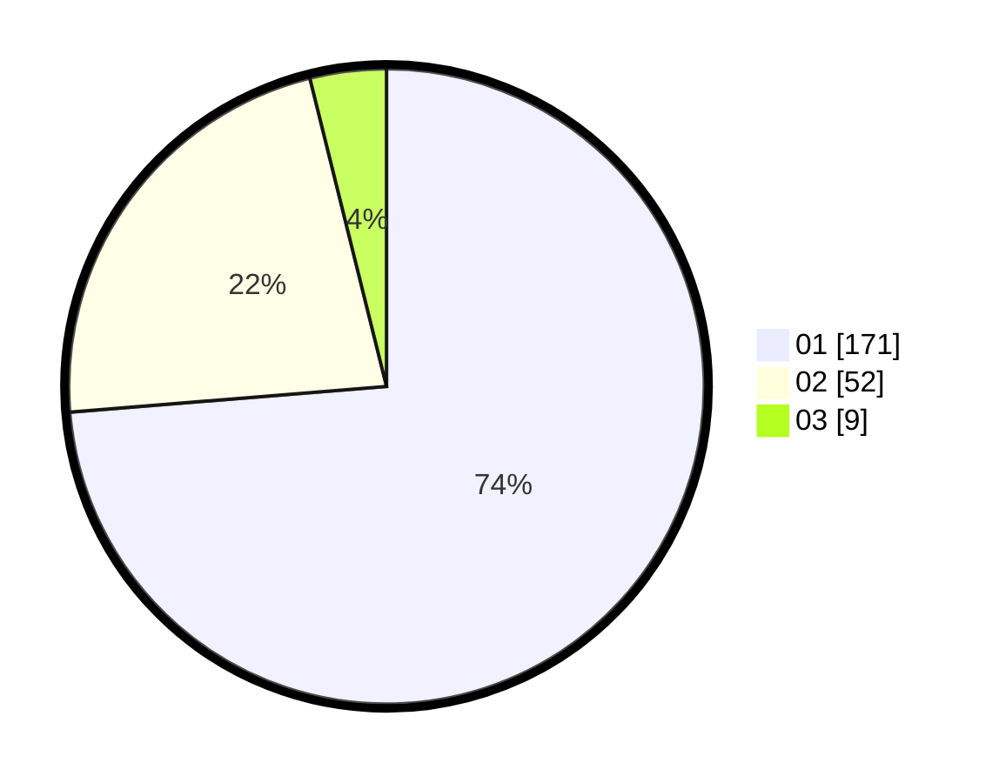

# Hasil

Hasil perolehan suara paslon dapat dilihat pada file paslon-01.txt, paslon-02.txt, dan paslon-03.txt.

Jika tidak ada, artinya data tersebut belum ada pada SIREKAP.

## Perolehan Suara

 * Paslon 01: **171**.
 * Paslon 02: **52**.
 * Paslon 03: **9**.

## Foto C Plano

https://sirekap-obj-formc.kpu.go.id/09dd/pemilu/ppwp/31/73/05/10/02/3173051002091-20240216-093359--c399ee51-f513-4c80-8c5f-e15433c0adeb.jpg

https://sirekap-obj-formc.kpu.go.id/09dd/pemilu/ppwp/31/73/05/10/02/3173051002091-20240216-094340--5a7133ce-5046-44c1-ab49-b42ecba2c0a6.jpg
