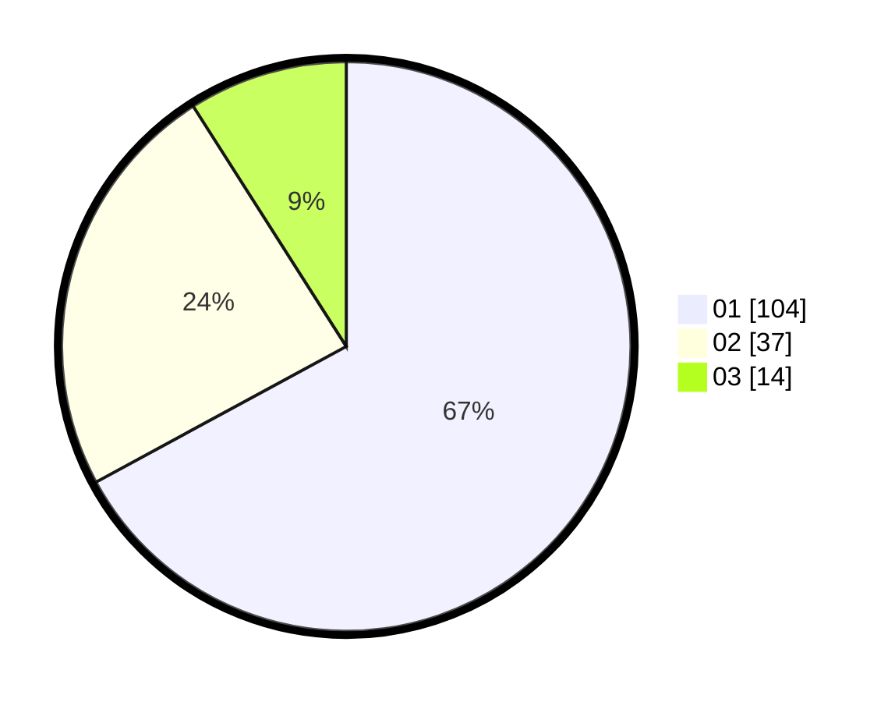

# Hasil

Hasil perolehan suara paslon dapat dilihat pada file paslon-01.txt, paslon-02.txt, dan paslon-03.txt.

Jika tidak ada, artinya data tersebut belum ada pada SIREKAP.

## Perolehan Suara

 * Paslon 01: **104**.
 * Paslon 02: **37**.
 * Paslon 03: **14**.

## Foto C Plano

https://sirekap-obj-formc.kpu.go.id/14f2/pemilu/ppwp/31/73/05/10/02/3173051002093-20240214-194152--5a73e9a7-01be-4d53-a967-16c93a5ef6da.jpg

https://sirekap-obj-formc.kpu.go.id/14f2/pemilu/ppwp/31/73/05/10/02/3173051002093-20240214-194508--378bec9d-d97c-4cee-8578-ba85a6d3b37c.jpg

https://sirekap-obj-formc.kpu.go.id/14f2/pemilu/ppwp/31/73/05/10/02/3173051002093-20240214-194617--fc397ea0-4a68-408b-b085-41216a72c7c4.jpg

## DATA PEMILIH TETAP

Jumlah pemilih dalam DPT: **216**.
 * L: **110**.
 * P: **106**.

## DATA PENGGUNA HAK PILIH

Jumlah pengguna hak pilih dalam DPT: **156**.
 * L: **76**.
 * P: **80**.

Jumlah pengguna hak pilih dalam DPTb: **0**.
 * L: **0**.
 * P: **0**.

Jumlah pengguna hak pilih dalam DPK: **2**.
 * L: **2**.
 * P: **0**.

Jumlah pengguna hak pilih: **158**.
 * L: **78**.
 * P: **80**.

## JUMLAH SUARA SAH DAN TIDAK SAH

JUMLAH SELURUH SUARA SAH: **155**.

JUMLAH SUARA TIDAK SAH: **3**.

JUMLAH SELURUH SUARA SAH DAN SUARA TIDAK SAH: **158**.
