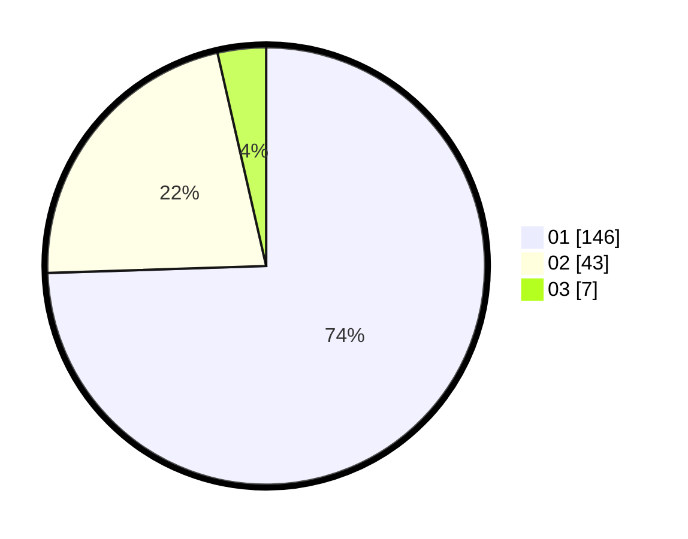

# Hasil

Hasil perolehan suara paslon dapat dilihat pada file paslon-01.txt, paslon-02.txt, dan paslon-03.txt.

Jika tidak ada, artinya data tersebut belum ada pada SIREKAP.

## Perolehan Suara

 * Paslon 01: **146**.
 * Paslon 02: **43**.
 * Paslon 03: **7**.

## Foto C Plano

https://sirekap-obj-formc.kpu.go.id/3637/pemilu/ppwp/31/73/05/10/02/3173051002099-20240214-223431--cd189c32-a523-4680-b43f-29cfbbe5533d.jpg

https://sirekap-obj-formc.kpu.go.id/3637/pemilu/ppwp/31/73/05/10/02/3173051002099-20240214-201355--0f57cf15-4669-44c6-b902-4f3f5e5859e7.jpg

https://sirekap-obj-formc.kpu.go.id/3637/pemilu/ppwp/31/73/05/10/02/3173051002099-20240214-201750--ac032733-0bfd-4b14-8dac-c00408279954.jpg
