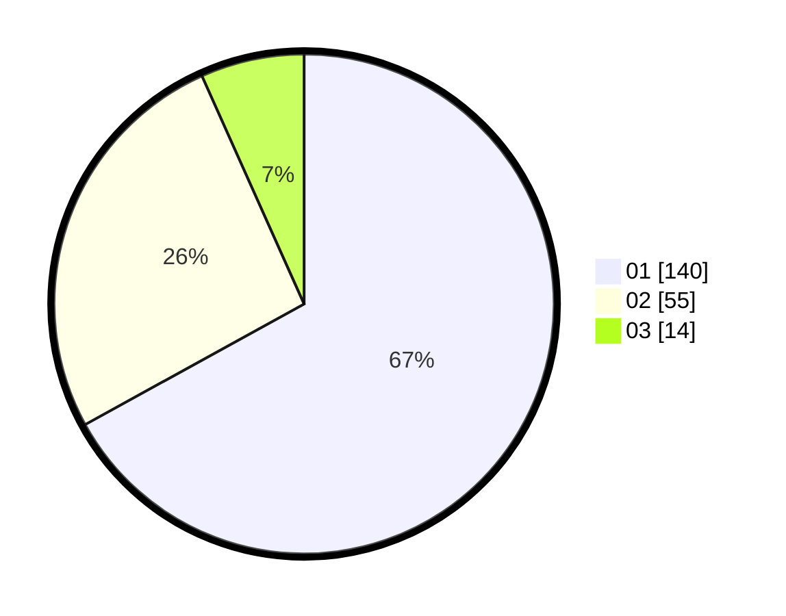

# Hasil

Hasil perolehan suara paslon dapat dilihat pada file paslon-01.txt, paslon-02.txt, dan paslon-03.txt.

Jika tidak ada, artinya data tersebut belum ada pada SIREKAP.

## Perolehan Suara

 * Paslon 01: **140**.
 * Paslon 02: **55**.
 * Paslon 03: **14**.

## Foto C Plano

https://sirekap-obj-formc.kpu.go.id/47aa/pemilu/ppwp/31/73/05/10/02/3173051002106-20240214-214024--255bc25a-a2f4-4d4a-bd17-d102ef8e6ddb.jpg

https://sirekap-obj-formc.kpu.go.id/47aa/pemilu/ppwp/31/73/05/10/02/3173051002106-20240214-231015--ffca232c-60d8-48be-b9f3-dabdebd08e17.jpg

https://sirekap-obj-formc.kpu.go.id/47aa/pemilu/ppwp/31/73/05/10/02/3173051002106-20240214-231118--557da37b-56e0-4934-9978-02d735e038ef.jpg
