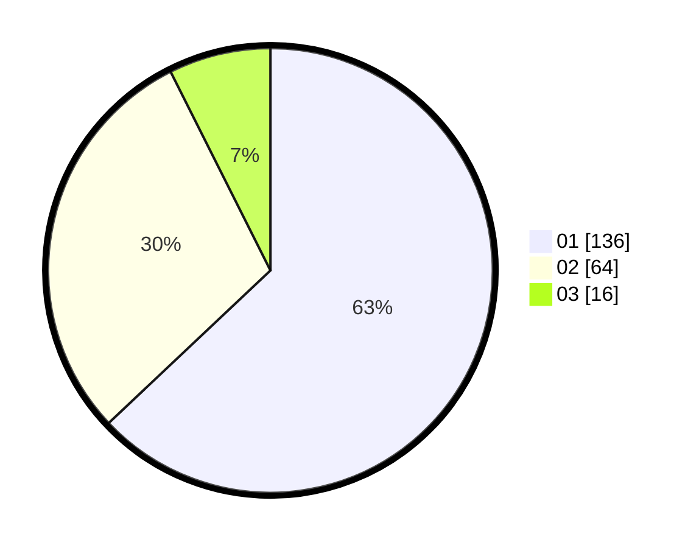

# Hasil

Hasil perolehan suara paslon dapat dilihat pada file paslon-01.txt, paslon-02.txt, dan paslon-03.txt.

Jika tidak ada, artinya data tersebut belum ada pada SIREKAP.

## Perolehan Suara

 * Paslon 01: **136**.
 * Paslon 02: **64**.
 * Paslon 03: **16**.

## Foto C Plano

https://sirekap-obj-formc.kpu.go.id/f736/pemilu/ppwp/31/73/05/10/02/3173051002107-20240214-155711--ab0d214e-ad7a-4b8c-b93e-813032238405.jpg

https://sirekap-obj-formc.kpu.go.id/f736/pemilu/ppwp/31/73/05/10/02/3173051002107-20240214-155816--767610f8-cd0b-4e1e-82eb-c2035e09d3dd.jpg
