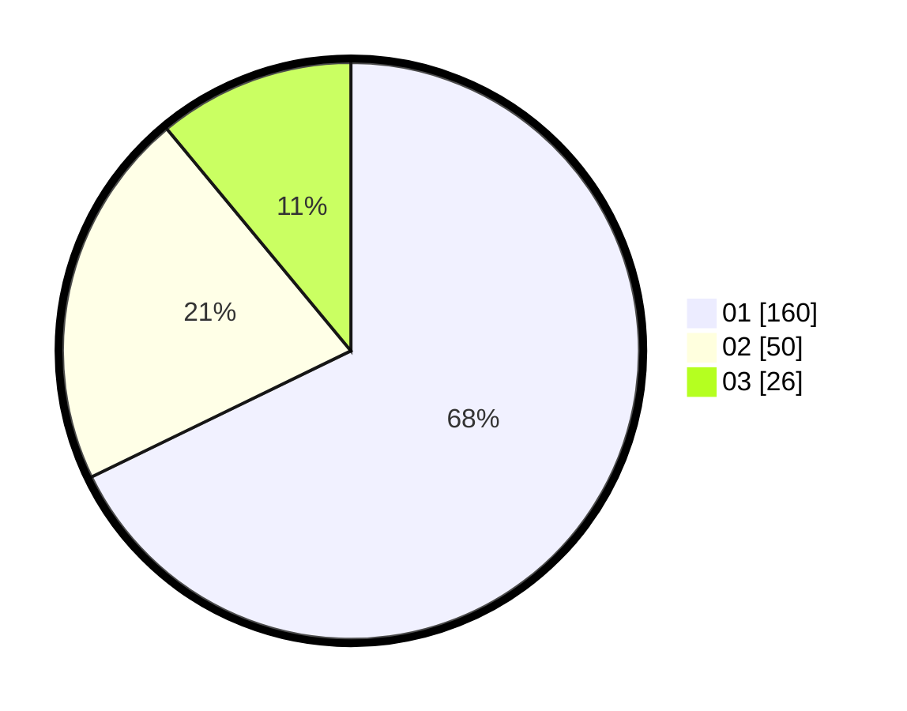

# Hasil

Hasil perolehan suara paslon dapat dilihat pada file paslon-01.txt, paslon-02.txt, dan paslon-03.txt.

Jika tidak ada, artinya data tersebut belum ada pada SIREKAP.

## Perolehan Suara

 * Paslon 01: **160**.
 * Paslon 02: **50**.
 * Paslon 03: **26**.

## Foto C Plano

https://sirekap-obj-formc.kpu.go.id/9542/pemilu/ppwp/31/73/05/10/02/3173051002108-20240214-201329--9812ce2a-51e7-4cd6-9f4d-611509192de5.jpg

https://sirekap-obj-formc.kpu.go.id/9542/pemilu/ppwp/31/73/05/10/02/3173051002108-20240214-225741--8fc7325d-7dd9-4dd6-b2d2-339a4d9c3ea4.jpg

https://sirekap-obj-formc.kpu.go.id/9542/pemilu/ppwp/31/73/05/10/02/3173051002108-20240214-201419--f900ab51-b0ca-4194-a446-5c5c4e7af6d3.jpg

## DATA PEMILIH TETAP

Jumlah pemilih dalam DPT: **289**.
 * L: **134**.
 * P: **151**.

## DATA PENGGUNA HAK PILIH

Jumlah pengguna hak pilih dalam DPT: **228**.
 * L: **172**.
 * P: **125**.

Jumlah pengguna hak pilih dalam DPTb: **4**.
 * L: **3**.
 * P: **3**.

Jumlah pengguna hak pilih dalam DPK: **7**.
 * L: **1**.
 * P: **5**.

Jumlah pengguna hak pilih: **239**.
 * L: **105**.
 * P: **134**.

## JUMLAH SUARA SAH DAN TIDAK SAH

JUMLAH SELURUH SUARA SAH: **236**.

JUMLAH SUARA TIDAK SAH: **3**.

JUMLAH SELURUH SUARA SAH DAN SUARA TIDAK SAH: **239**.
