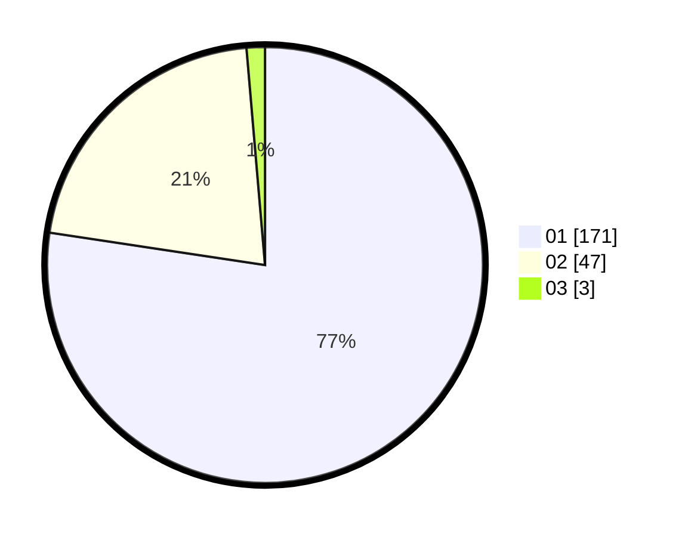

# Hasil

Hasil perolehan suara paslon dapat dilihat pada file paslon-01.txt, paslon-02.txt, dan paslon-03.txt.

Jika tidak ada, artinya data tersebut belum ada pada SIREKAP.

## Perolehan Suara

 * Paslon 01: **171**.
 * Paslon 02: **47**.
 * Paslon 03: **3**.

## Foto C Plano

https://sirekap-obj-formc.kpu.go.id/51ad/pemilu/ppwp/31/73/05/10/02/3173051002110-20240214-201710--45145e66-f0fe-4740-b322-6dd5c0b65f94.jpg

https://sirekap-obj-formc.kpu.go.id/51ad/pemilu/ppwp/31/73/05/10/02/3173051002110-20240214-201945--f29ba45f-35bf-4bef-bc0e-f7ec1b447074.jpg

https://sirekap-obj-formc.kpu.go.id/51ad/pemilu/ppwp/31/73/05/10/02/3173051002110-20240214-202213--6ac7fd18-f5cf-4adc-9843-4ec31e208a11.jpg
