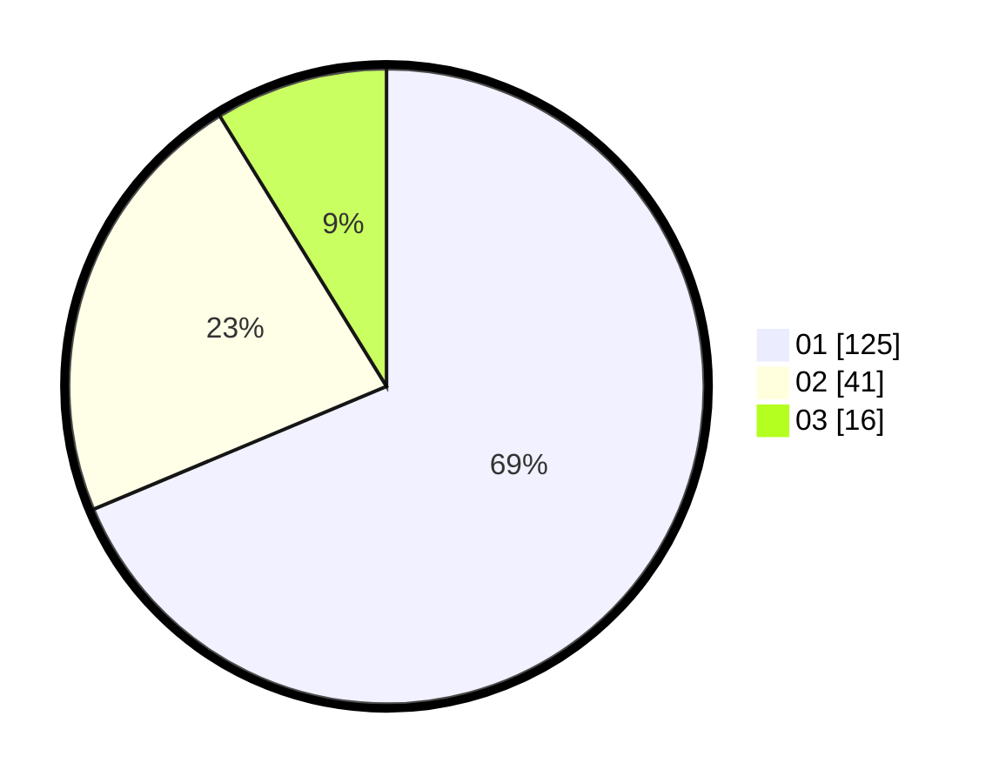

# Hasil

Hasil perolehan suara paslon dapat dilihat pada file paslon-01.txt, paslon-02.txt, dan paslon-03.txt.

Jika tidak ada, artinya data tersebut belum ada pada SIREKAP.

## Perolehan Suara

 * Paslon 01: **125**.
 * Paslon 02: **41**.
 * Paslon 03: **16**.

## Foto C Plano

https://sirekap-obj-formc.kpu.go.id/0aed/pemilu/ppwp/31/73/05/10/02/3173051002111-20240214-215432--7616f9ab-cf6b-4a22-ac72-d9d677160283.jpg

https://sirekap-obj-formc.kpu.go.id/0aed/pemilu/ppwp/31/73/05/10/02/3173051002111-20240214-215724--6a63b5be-2672-4d8c-a4c0-06c39de02c02.jpg

https://sirekap-obj-formc.kpu.go.id/0aed/pemilu/ppwp/31/73/05/10/02/3173051002111-20240214-215754--e3b609ba-6ddb-4082-affa-3c97f3af8a98.jpg
