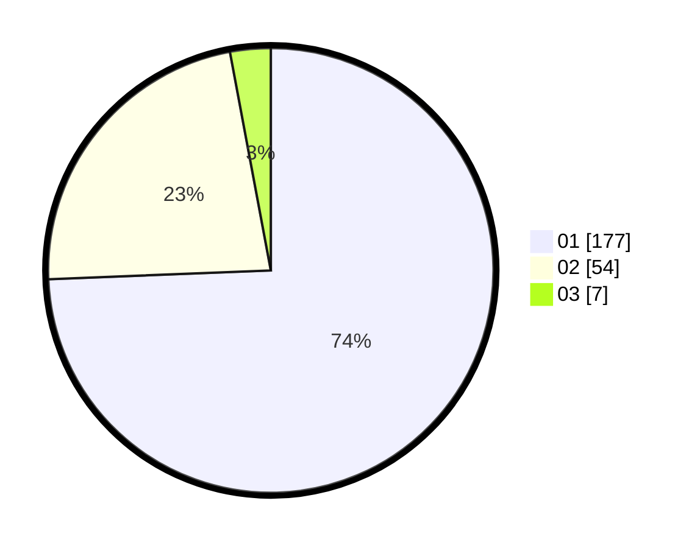

# Hasil

Hasil perolehan suara paslon dapat dilihat pada file paslon-01.txt, paslon-02.txt, dan paslon-03.txt.

Jika tidak ada, artinya data tersebut belum ada pada SIREKAP.

## Perolehan Suara

 * Paslon 01: **177**.
 * Paslon 02: **54**.
 * Paslon 03: **7**.

## Foto C Plano

https://sirekap-obj-formc.kpu.go.id/83b8/pemilu/ppwp/31/73/05/10/02/3173051002113-20240215-004857--1a1d6fcd-8d09-40a3-b9a4-dce06b1eec83.jpg

https://sirekap-obj-formc.kpu.go.id/83b8/pemilu/ppwp/31/73/05/10/02/3173051002113-20240215-005055--3859d2e8-1d7c-495c-9f7f-c764b51d2a55.jpg

https://sirekap-obj-formc.kpu.go.id/83b8/pemilu/ppwp/31/73/05/10/02/3173051002113-20240215-005436--96c599ae-b754-42b9-bd75-ebdd8fba9304.jpg
