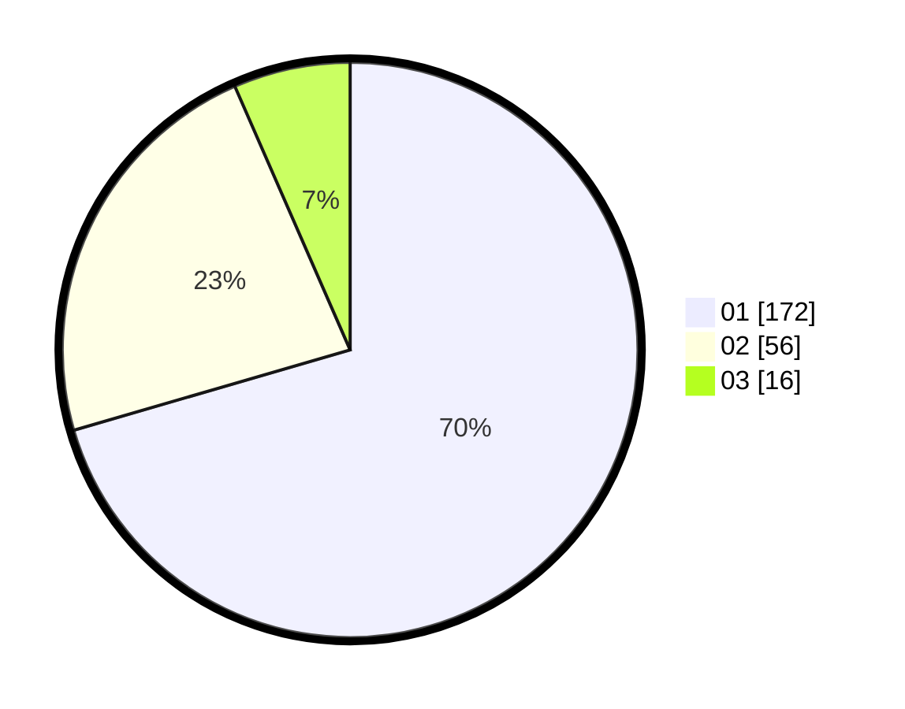

# Hasil

Hasil perolehan suara paslon dapat dilihat pada file paslon-01.txt, paslon-02.txt, dan paslon-03.txt.

Jika tidak ada, artinya data tersebut belum ada pada SIREKAP.

## Perolehan Suara

 * Paslon 01: **172**.
 * Paslon 02: **56**.
 * Paslon 03: **16**.

## Foto C Plano

https://sirekap-obj-formc.kpu.go.id/4a95/pemilu/ppwp/31/73/05/10/02/3173051002122-20240216-075959--eaec7bea-74fe-4aa4-b8dd-5ee79271da2e.jpg

https://sirekap-obj-formc.kpu.go.id/4a95/pemilu/ppwp/31/73/05/10/02/3173051002122-20240216-080000--bf2a2a19-ca5d-4027-af75-98b118cea3fd.jpg

https://sirekap-obj-formc.kpu.go.id/4a95/pemilu/ppwp/31/73/05/10/02/3173051002122-20240216-080000--0c8dc422-1e47-4402-b844-5383c592a773.jpg

## DATA PEMILIH TETAP

Jumlah pemilih dalam DPT: **244**.
 * L: **111**.
 * P: **133**.

## DATA PENGGUNA HAK PILIH

Jumlah pengguna hak pilih dalam DPT: **233**.
 * L: **107**.
 * P: **126**.

Jumlah pengguna hak pilih dalam DPTb: **9**.
 * L: **4**.
 * P: **5**.

Jumlah pengguna hak pilih dalam DPK: **2**.
 * L: **0**.
 * P: **2**.

Jumlah pengguna hak pilih: **244**.
 * L: **111**.
 * P: **133**.

## JUMLAH SUARA SAH DAN TIDAK SAH

JUMLAH SELURUH SUARA SAH: **244**.

JUMLAH SUARA TIDAK SAH: **0**.

JUMLAH SELURUH SUARA SAH DAN SUARA TIDAK SAH: **244**.
