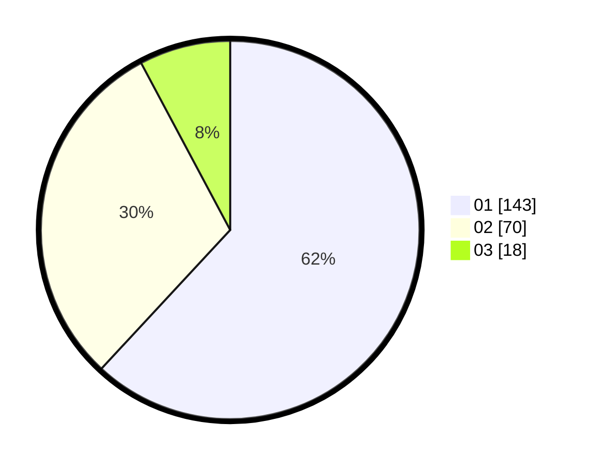

# Hasil

Hasil perolehan suara paslon dapat dilihat pada file paslon-01.txt, paslon-02.txt, dan paslon-03.txt.

Jika tidak ada, artinya data tersebut belum ada pada SIREKAP.

## Perolehan Suara

 * Paslon 01: **143**.
 * Paslon 02: **70**.
 * Paslon 03: **18**.

## Foto C Plano

https://sirekap-obj-formc.kpu.go.id/667f/pemilu/ppwp/31/73/05/10/02/3173051002125-20240216-035906--11c33f83-9bd2-4d2d-a296-b8ba8ea3f476.jpg

https://sirekap-obj-formc.kpu.go.id/667f/pemilu/ppwp/31/73/05/10/02/3173051002125-20240216-035907--2bd81aa5-30a4-4e79-8c80-37ed83fa379f.jpg

https://sirekap-obj-formc.kpu.go.id/667f/pemilu/ppwp/31/73/05/10/02/3173051002125-20240216-035907--b37011c4-caf6-4216-a087-601345f4db17.jpg

## DATA PEMILIH TETAP

Jumlah pemilih dalam DPT: **277**.
 * L: **137**.
 * P: **140**.

## DATA PENGGUNA HAK PILIH

Jumlah pengguna hak pilih dalam DPT: **225**.
 * L: **107**.
 * P: **118**.

Jumlah pengguna hak pilih dalam DPTb: **5**.
 * L: **2**.
 * P: **3**.

Jumlah pengguna hak pilih dalam DPK: **2**.
 * L: **1**.
 * P: **1**.

Jumlah pengguna hak pilih: **232**.
 * L: **110**.
 * P: **122**.

## JUMLAH SUARA SAH DAN TIDAK SAH

JUMLAH SELURUH SUARA SAH: **231**.

JUMLAH SUARA TIDAK SAH: **1**.

JUMLAH SELURUH SUARA SAH DAN SUARA TIDAK SAH: **232**.
