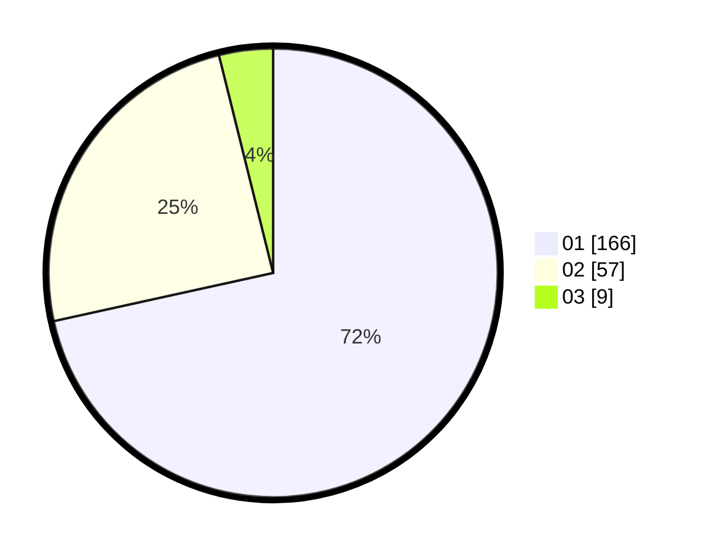

# Hasil

Hasil perolehan suara paslon dapat dilihat pada file paslon-01.txt, paslon-02.txt, dan paslon-03.txt.

Jika tidak ada, artinya data tersebut belum ada pada SIREKAP.

## Perolehan Suara

 * Paslon 01: **166**.
 * Paslon 02: **57**.
 * Paslon 03: **9**.

## Foto C Plano

https://sirekap-obj-formc.kpu.go.id/e30a/pemilu/ppwp/31/73/05/10/02/3173051002126-20240214-192151--10c1f1a1-6b44-4a49-a127-2b06871f6f8c.jpg

https://sirekap-obj-formc.kpu.go.id/e30a/pemilu/ppwp/31/73/05/10/02/3173051002126-20240214-192156--0148c5bd-c9f2-46df-868d-470b70aa7751.jpg

https://sirekap-obj-formc.kpu.go.id/e30a/pemilu/ppwp/31/73/05/10/02/3173051002126-20240214-192201--64fddf4b-4d4e-4bac-b831-4c5510909aef.jpg

## DATA PEMILIH TETAP

Jumlah pemilih dalam DPT: **276**.
 * L: **132**.
 * P: **144**.

## DATA PENGGUNA HAK PILIH

Jumlah pengguna hak pilih dalam DPT: **229**.
 * L: **111**.
 * P: **118**.

Jumlah pengguna hak pilih dalam DPTb: **5**.
 * L: **2**.
 * P: **3**.

Jumlah pengguna hak pilih dalam DPK: **1**.
 * L: **0**.
 * P: **1**.

Jumlah pengguna hak pilih: **235**.
 * L: **113**.
 * P: **122**.

## JUMLAH SUARA SAH DAN TIDAK SAH

JUMLAH SELURUH SUARA SAH: **232**.

JUMLAH SUARA TIDAK SAH: **3**.

JUMLAH SELURUH SUARA SAH DAN SUARA TIDAK SAH: **235**.
