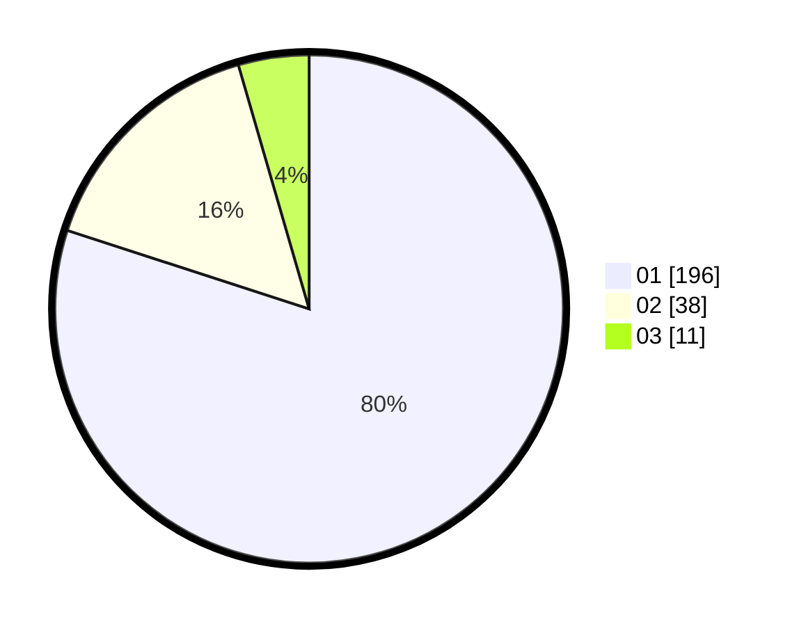

# Hasil

Hasil perolehan suara paslon dapat dilihat pada file paslon-01.txt, paslon-02.txt, dan paslon-03.txt.

Jika tidak ada, artinya data tersebut belum ada pada SIREKAP.

## Perolehan Suara

 * Paslon 01: **196**.
 * Paslon 02: **38**.
 * Paslon 03: **11**.

## Foto C Plano

https://sirekap-obj-formc.kpu.go.id/4285/pemilu/ppwp/31/73/05/10/02/3173051002130-20240214-231300--7b17a950-4f0c-46aa-a1db-08b556d6c43b.jpg

https://sirekap-obj-formc.kpu.go.id/4285/pemilu/ppwp/31/73/05/10/02/3173051002130-20240214-231410--10491581-207b-4962-99b4-ff7a94e8f93a.jpg

https://sirekap-obj-formc.kpu.go.id/4285/pemilu/ppwp/31/73/05/10/02/3173051002130-20240214-232903--40df500e-c99e-47a9-b5d3-0cdf3498f5af.jpg
