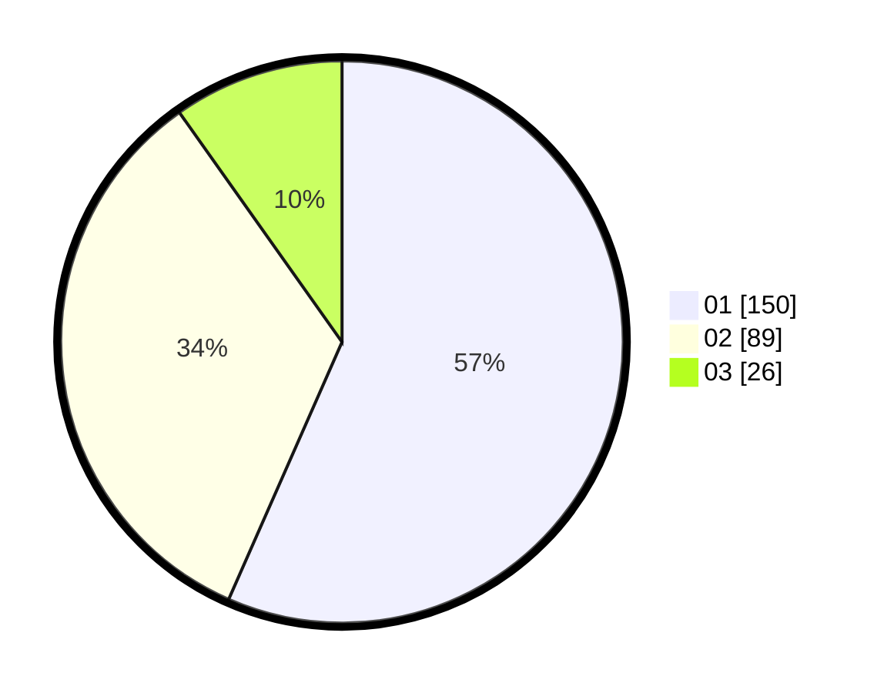

# Hasil

Hasil perolehan suara paslon dapat dilihat pada file paslon-01.txt, paslon-02.txt, dan paslon-03.txt.

Jika tidak ada, artinya data tersebut belum ada pada SIREKAP.

## Perolehan Suara

 * Paslon 01: **150**.
 * Paslon 02: **89**.
 * Paslon 03: **26**.

## Foto C Plano

https://sirekap-obj-formc.kpu.go.id/1eed/pemilu/ppwp/31/73/05/10/03/3173051003002-20240214-195443--d4d7108b-ffe5-44f4-8eea-c1e76afa7c59.jpg

https://sirekap-obj-formc.kpu.go.id/1eed/pemilu/ppwp/31/73/05/10/03/3173051003002-20240214-192437--4b9b4ea2-0202-44bd-aceb-9ad98420ed79.jpg

https://sirekap-obj-formc.kpu.go.id/1eed/pemilu/ppwp/31/73/05/10/03/3173051003002-20240214-192555--e6d95010-a2e9-42ad-8b76-c65b1c0947e7.jpg

## DATA PEMILIH TETAP

Jumlah pemilih dalam DPT: **290**.
 * L: **134**.
 * P: **156**.

## DATA PENGGUNA HAK PILIH

Jumlah pengguna hak pilih dalam DPT: **259**.
 * L: **120**.
 * P: **139**.

Jumlah pengguna hak pilih dalam DPTb: **1**.
 * L: **0**.
 * P: **1**.

Jumlah pengguna hak pilih dalam DPK: **9**.
 * L: **6**.
 * P: **3**.

Jumlah pengguna hak pilih: **269**.
 * L: **126**.
 * P: **143**.

## JUMLAH SUARA SAH DAN TIDAK SAH

JUMLAH SELURUH SUARA SAH: **265**.

JUMLAH SUARA TIDAK SAH: **4**.

JUMLAH SELURUH SUARA SAH DAN SUARA TIDAK SAH: **269**.
