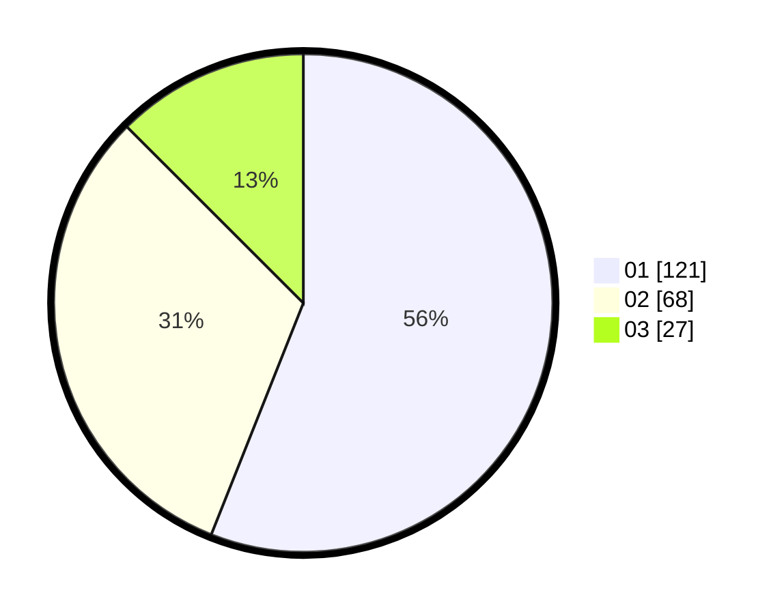

# Hasil

Hasil perolehan suara paslon dapat dilihat pada file paslon-01.txt, paslon-02.txt, dan paslon-03.txt.

Jika tidak ada, artinya data tersebut belum ada pada SIREKAP.

## Perolehan Suara

 * Paslon 01: **121**.
 * Paslon 02: **68**.
 * Paslon 03: **27**.

## Foto C Plano

https://sirekap-obj-formc.kpu.go.id/0e5f/pemilu/ppwp/31/73/05/10/03/3173051003009-20240216-003256--f5ad9845-08b3-4d3c-b5ae-f4fcc88775c3.jpg

https://sirekap-obj-formc.kpu.go.id/0e5f/pemilu/ppwp/31/73/05/10/03/3173051003009-20240216-003309--3f00f2bb-e8b6-40c2-8121-a7c8f457d105.jpg

https://sirekap-obj-formc.kpu.go.id/0e5f/pemilu/ppwp/31/73/05/10/03/3173051003009-20240216-003305--bef1a4af-1124-4541-975e-8aa749870a3a.jpg

## DATA PEMILIH TETAP

Jumlah pemilih dalam DPT: **0**.
 * L: **0**.
 * P: **0**.

## DATA PENGGUNA HAK PILIH

Jumlah pengguna hak pilih dalam DPT: **0**.
 * L: **0**.
 * P: **0**.

Jumlah pengguna hak pilih dalam DPTb: **0**.
 * L: **0**.
 * P: **0**.

Jumlah pengguna hak pilih dalam DPK: **0**.
 * L: **0**.
 * P: **0**.

Jumlah pengguna hak pilih: **0**.
 * L: **0**.
 * P: **0**.

## JUMLAH SUARA SAH DAN TIDAK SAH

JUMLAH SELURUH SUARA SAH: **216**.

JUMLAH SUARA TIDAK SAH: **5**.

JUMLAH SELURUH SUARA SAH DAN SUARA TIDAK SAH: **221**.
