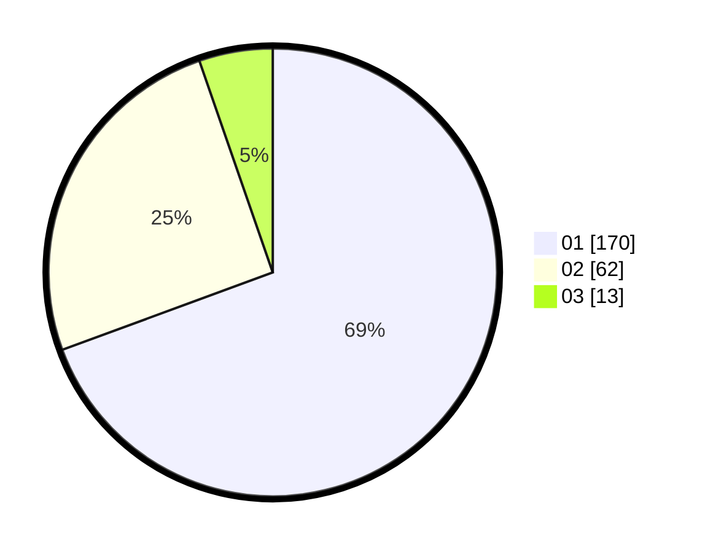

# Hasil

Hasil perolehan suara paslon dapat dilihat pada file paslon-01.txt, paslon-02.txt, dan paslon-03.txt.

Jika tidak ada, artinya data tersebut belum ada pada SIREKAP.

## Perolehan Suara

 * Paslon 01: **170**.
 * Paslon 02: **62**.
 * Paslon 03: **13**.

## Foto C Plano

https://sirekap-obj-formc.kpu.go.id/31ea/pemilu/ppwp/31/73/05/10/03/3173051003010-20240214-204616--711d1809-a1a3-4346-ad99-92f863fba874.jpg

https://sirekap-obj-formc.kpu.go.id/31ea/pemilu/ppwp/31/73/05/10/03/3173051003010-20240214-204715--4b10106d-ecb3-49b1-919c-c2e8d3ef1f93.jpg

https://sirekap-obj-formc.kpu.go.id/31ea/pemilu/ppwp/31/73/05/10/03/3173051003010-20240214-234855--b4976af1-1384-42e1-9a54-bb25c1a3c825.jpg
