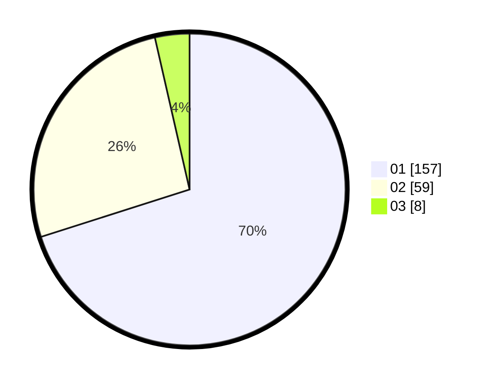

# Hasil

Hasil perolehan suara paslon dapat dilihat pada file paslon-01.txt, paslon-02.txt, dan paslon-03.txt.

Jika tidak ada, artinya data tersebut belum ada pada SIREKAP.

## Perolehan Suara

 * Paslon 01: **157**.
 * Paslon 02: **59**.
 * Paslon 03: **8**.

## Foto C Plano

https://sirekap-obj-formc.kpu.go.id/59a1/pemilu/ppwp/31/73/05/10/03/3173051003011-20240214-221423--47fa95e1-f95e-4413-8e58-569848b5c6a4.jpg

https://sirekap-obj-formc.kpu.go.id/59a1/pemilu/ppwp/31/73/05/10/03/3173051003011-20240214-221724--22a941bb-86ff-4c77-b341-b649c09018df.jpg

https://sirekap-obj-formc.kpu.go.id/59a1/pemilu/ppwp/31/73/05/10/03/3173051003011-20240214-221836--b048acf6-0831-4f77-8d23-570f0ace5909.jpg
