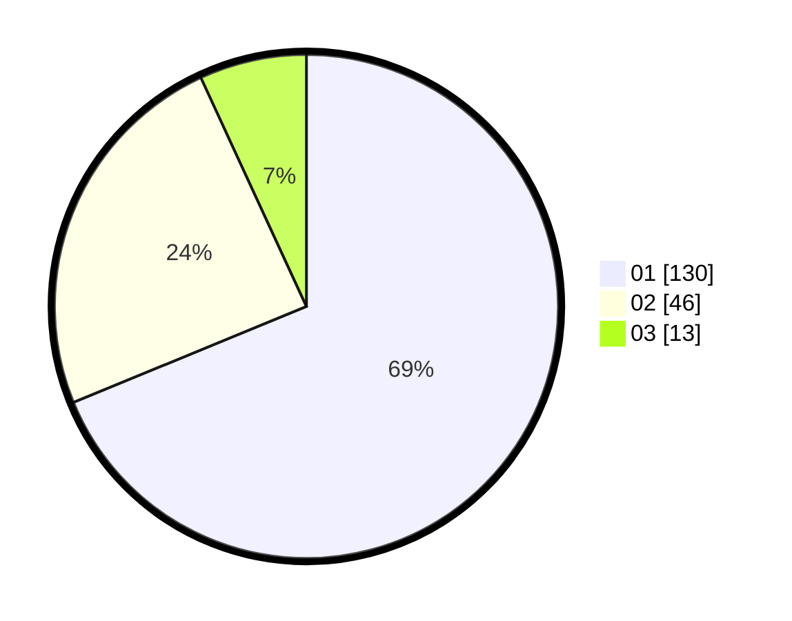

# Hasil

Hasil perolehan suara paslon dapat dilihat pada file paslon-01.txt, paslon-02.txt, dan paslon-03.txt.

Jika tidak ada, artinya data tersebut belum ada pada SIREKAP.

## Perolehan Suara

 * Paslon 01: **130**.
 * Paslon 02: **46**.
 * Paslon 03: **13**.

## Foto C Plano

https://sirekap-obj-formc.kpu.go.id/5db2/pemilu/ppwp/31/73/05/10/03/3173051003013-20240216-201136--eac4220e-e6e3-4382-b51d-33de9bb60a1d.jpg

https://sirekap-obj-formc.kpu.go.id/5db2/pemilu/ppwp/31/73/05/10/03/3173051003013-20240215-003707--08cdbf4c-611e-4517-8e3f-9235c3178d77.jpg

https://sirekap-obj-formc.kpu.go.id/5db2/pemilu/ppwp/31/73/05/10/03/3173051003013-20240215-003759--ea44920d-5f5f-4495-a7c4-887ec20872a1.jpg
