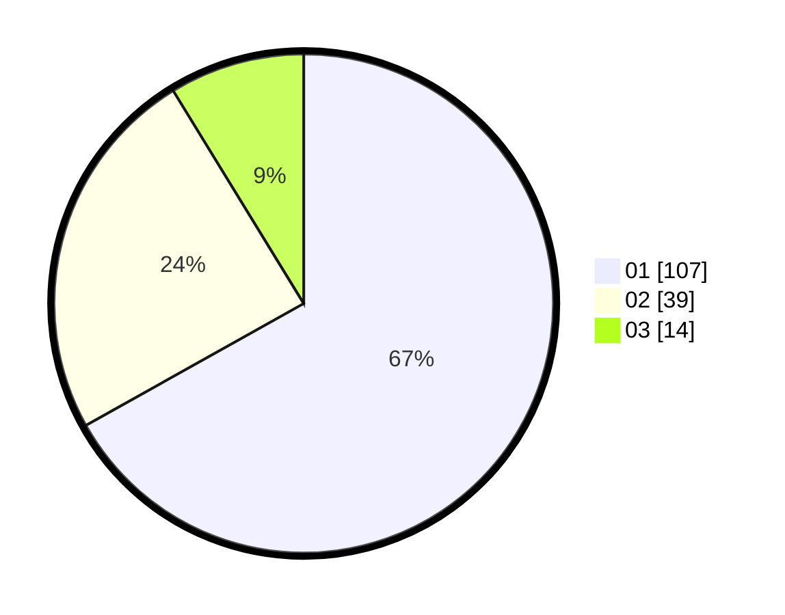

# Hasil

Hasil perolehan suara paslon dapat dilihat pada file paslon-01.txt, paslon-02.txt, dan paslon-03.txt.

Jika tidak ada, artinya data tersebut belum ada pada SIREKAP.

## Perolehan Suara

 * Paslon 01: **107**.
 * Paslon 02: **39**.
 * Paslon 03: **14**.

## Foto C Plano

https://sirekap-obj-formc.kpu.go.id/11b7/pemilu/ppwp/31/73/05/10/03/3173051003015-20240214-191754--8c1c754f-a112-4cde-bb10-c49608ded285.jpg

https://sirekap-obj-formc.kpu.go.id/11b7/pemilu/ppwp/31/73/05/10/03/3173051003015-20240214-191325--4a429756-14c6-4929-af92-5680ddbb370d.jpg

https://sirekap-obj-formc.kpu.go.id/11b7/pemilu/ppwp/31/73/05/10/03/3173051003015-20240214-191407--c26a8505-5e9e-4c82-8652-e88ea0f78369.jpg

## DATA PEMILIH TETAP

Jumlah pemilih dalam DPT: **182**.
 * L: **87**.
 * P: **95**.

## DATA PENGGUNA HAK PILIH

Jumlah pengguna hak pilih dalam DPT: **154**.
 * L: **78**.
 * P: **76**.

Jumlah pengguna hak pilih dalam DPTb: **1**.
 * L: **0**.
 * P: **1**.

Jumlah pengguna hak pilih dalam DPK: **7**.
 * L: **3**.
 * P: **4**.

Jumlah pengguna hak pilih: **162**.
 * L: **81**.
 * P: **81**.

## JUMLAH SUARA SAH DAN TIDAK SAH

JUMLAH SELURUH SUARA SAH: **160**.

JUMLAH SUARA TIDAK SAH: **2**.

JUMLAH SELURUH SUARA SAH DAN SUARA TIDAK SAH: **162**.
