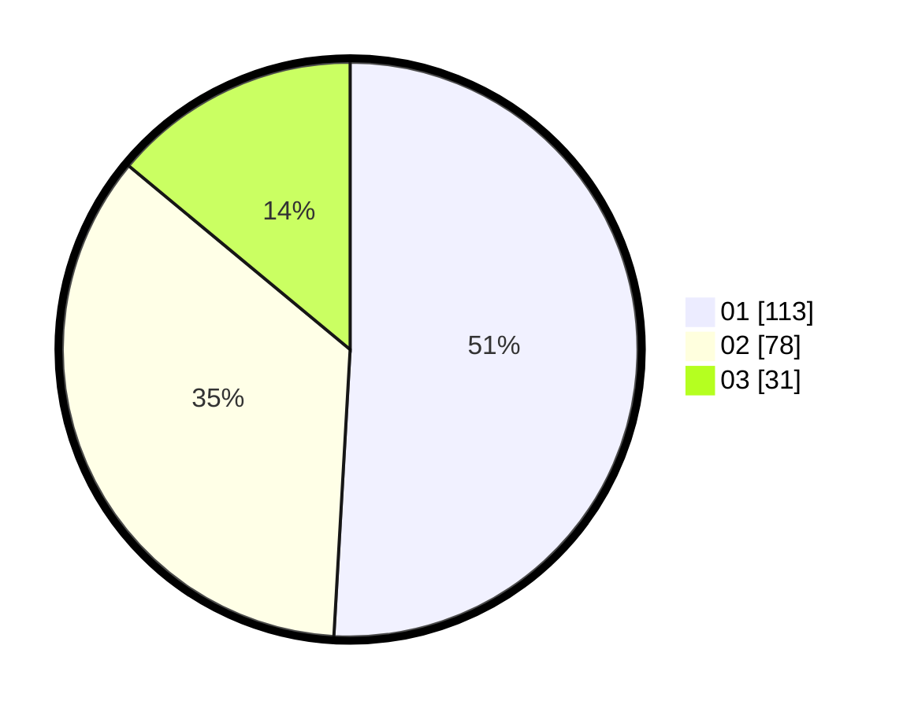

# Hasil

Hasil perolehan suara paslon dapat dilihat pada file paslon-01.txt, paslon-02.txt, dan paslon-03.txt.

Jika tidak ada, artinya data tersebut belum ada pada SIREKAP.

## Perolehan Suara

 * Paslon 01: **113**.
 * Paslon 02: **78**.
 * Paslon 03: **31**.

## Foto C Plano

https://sirekap-obj-formc.kpu.go.id/a49a/pemilu/ppwp/31/73/05/10/03/3173051003018-20240214-203041--af9bd746-f58b-4f70-842b-6d8902e589ca.jpg

https://sirekap-obj-formc.kpu.go.id/a49a/pemilu/ppwp/31/73/05/10/03/3173051003018-20240214-193525--8cd233e9-66da-46db-bb1f-fca35c5c84b4.jpg

https://sirekap-obj-formc.kpu.go.id/a49a/pemilu/ppwp/31/73/05/10/03/3173051003018-20240214-193529--ecd36b84-9a4b-41a9-893e-bf46c78623c6.jpg

## DATA PEMILIH TETAP

Jumlah pemilih dalam DPT: **256**.
 * L: **128**.
 * P: **128**.

## DATA PENGGUNA HAK PILIH

Jumlah pengguna hak pilih dalam DPT: **223**.
 * L: **112**.
 * P: **111**.

Jumlah pengguna hak pilih dalam DPTb: **0**.
 * L: **0**.
 * P: **0**.

Jumlah pengguna hak pilih dalam DPK: **7**.
 * L: **3**.
 * P: **4**.

Jumlah pengguna hak pilih: **230**.
 * L: **115**.
 * P: **115**.

## JUMLAH SUARA SAH DAN TIDAK SAH

JUMLAH SELURUH SUARA SAH: **222**.

JUMLAH SUARA TIDAK SAH: **8**.

JUMLAH SELURUH SUARA SAH DAN SUARA TIDAK SAH: **230**.
