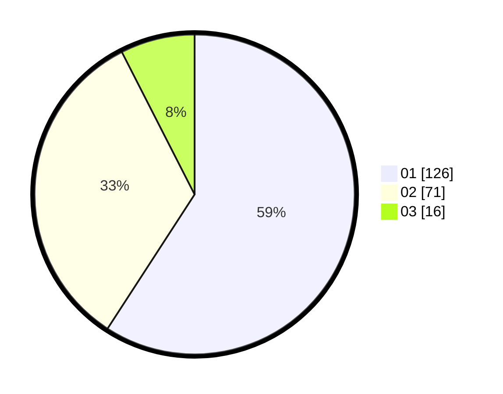

# Hasil

Hasil perolehan suara paslon dapat dilihat pada file paslon-01.txt, paslon-02.txt, dan paslon-03.txt.

Jika tidak ada, artinya data tersebut belum ada pada SIREKAP.

## Perolehan Suara

 * Paslon 01: **126**.
 * Paslon 02: **71**.
 * Paslon 03: **16**.

## Foto C Plano

https://sirekap-obj-formc.kpu.go.id/1789/pemilu/ppwp/31/73/05/10/03/3173051003020-20240215-161931--ee337450-04ff-40e0-aecd-cf51754d2370.jpg

https://sirekap-obj-formc.kpu.go.id/1789/pemilu/ppwp/31/73/05/10/03/3173051003020-20240215-161953--30ceaee1-3204-4b35-a97d-96ecc7b06430.jpg

https://sirekap-obj-formc.kpu.go.id/1789/pemilu/ppwp/31/73/05/10/03/3173051003020-20240215-162010--02f5e8c6-e613-4bfb-99b8-ba7bcf088031.jpg
