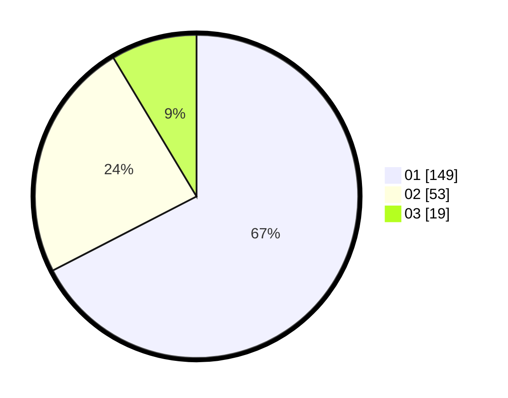

# Hasil

Hasil perolehan suara paslon dapat dilihat pada file paslon-01.txt, paslon-02.txt, dan paslon-03.txt.

Jika tidak ada, artinya data tersebut belum ada pada SIREKAP.

## Perolehan Suara

 * Paslon 01: **149**.
 * Paslon 02: **53**.
 * Paslon 03: **19**.

## Foto C Plano

https://sirekap-obj-formc.kpu.go.id/da8f/pemilu/ppwp/31/73/05/10/03/3173051003025-20240214-215457--ea801822-1010-498c-842b-26590fbb4878.jpg

https://sirekap-obj-formc.kpu.go.id/da8f/pemilu/ppwp/31/73/05/10/03/3173051003025-20240214-233620--a0ee42ef-09fb-434e-8988-adcd3f73ddc6.jpg

https://sirekap-obj-formc.kpu.go.id/da8f/pemilu/ppwp/31/73/05/10/03/3173051003025-20240214-231615--2e41f031-668f-4804-b20e-e5dcedeb2f11.jpg
