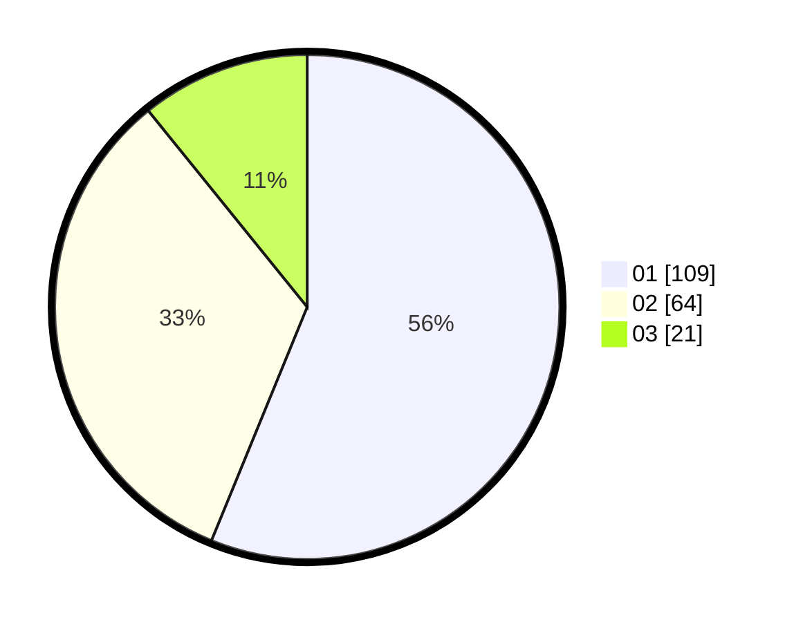

# Hasil

Hasil perolehan suara paslon dapat dilihat pada file paslon-01.txt, paslon-02.txt, dan paslon-03.txt.

Jika tidak ada, artinya data tersebut belum ada pada SIREKAP.

## Perolehan Suara

 * Paslon 01: **109**.
 * Paslon 02: **64**.
 * Paslon 03: **21**.

## Foto C Plano

https://sirekap-obj-formc.kpu.go.id/2f91/pemilu/ppwp/31/73/05/10/03/3173051003029-20240214-221234--0262ebf7-fa09-4f08-aa20-6a3732e79950.jpg

https://sirekap-obj-formc.kpu.go.id/2f91/pemilu/ppwp/31/73/05/10/03/3173051003029-20240214-222113--bfcdf40f-3b58-4c7b-bfd3-bacfd547cd9a.jpg
