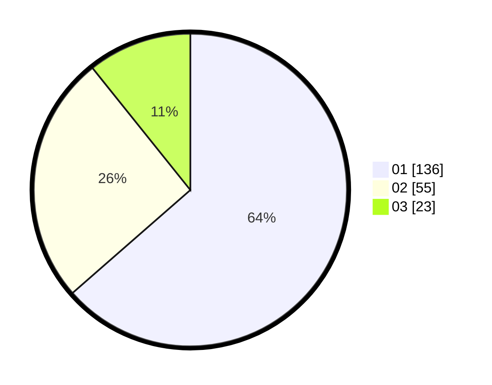

# Hasil

Hasil perolehan suara paslon dapat dilihat pada file paslon-01.txt, paslon-02.txt, dan paslon-03.txt.

Jika tidak ada, artinya data tersebut belum ada pada SIREKAP.

## Perolehan Suara

 * Paslon 01: **136**.
 * Paslon 02: **55**.
 * Paslon 03: **23**.

## Foto C Plano

https://sirekap-obj-formc.kpu.go.id/5526/pemilu/ppwp/31/73/05/10/03/3173051003032-20240214-211258--40d75ae6-308a-409c-8bbb-c7b98c9fbe9d.jpg

https://sirekap-obj-formc.kpu.go.id/5526/pemilu/ppwp/31/73/05/10/03/3173051003032-20240215-005524--cc08e641-0347-4edb-9b2e-364f48ede943.jpg

https://sirekap-obj-formc.kpu.go.id/5526/pemilu/ppwp/31/73/05/10/03/3173051003032-20240215-005605--a03c7e74-1a87-469a-b98c-f4c790c876b8.jpg

## DATA PEMILIH TETAP

Jumlah pemilih dalam DPT: **254**.
 * L: **130**.
 * P: **124**.

## DATA PENGGUNA HAK PILIH

Jumlah pengguna hak pilih dalam DPT: **214**.
 * L: **107**.
 * P: **107**.

Jumlah pengguna hak pilih dalam DPTb: **0**.
 * L: **0**.
 * P: **0**.

Jumlah pengguna hak pilih dalam DPK: **4**.
 * L: **3**.
 * P: **1**.

Jumlah pengguna hak pilih: **218**.
 * L: **110**.
 * P: **108**.

## JUMLAH SUARA SAH DAN TIDAK SAH

JUMLAH SELURUH SUARA SAH: **214**.

JUMLAH SUARA TIDAK SAH: **4**.

JUMLAH SELURUH SUARA SAH DAN SUARA TIDAK SAH: **218**.
