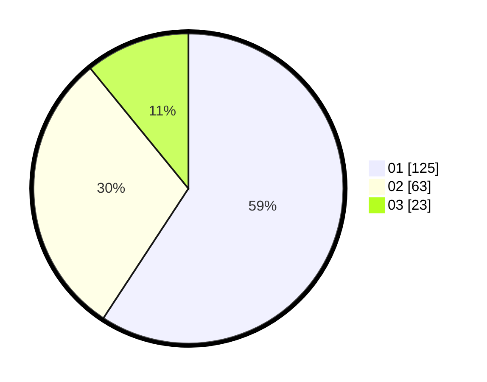

# Hasil

Hasil perolehan suara paslon dapat dilihat pada file paslon-01.txt, paslon-02.txt, dan paslon-03.txt.

Jika tidak ada, artinya data tersebut belum ada pada SIREKAP.

## Perolehan Suara

 * Paslon 01: **125**.
 * Paslon 02: **63**.
 * Paslon 03: **23**.

## Foto C Plano

https://sirekap-obj-formc.kpu.go.id/ae68/pemilu/ppwp/31/73/05/10/03/3173051003033-20240214-155158--46e2b6aa-07fe-48b2-87a8-fb86274dd8c8.jpg

https://sirekap-obj-formc.kpu.go.id/ae68/pemilu/ppwp/31/73/05/10/03/3173051003033-20240214-155306--21e4596e-37fa-4624-baca-021a2cb5f7ee.jpg

https://sirekap-obj-formc.kpu.go.id/ae68/pemilu/ppwp/31/73/05/10/03/3173051003033-20240214-155354--c0014adc-93a0-427e-96d9-6c5fd797db32.jpg

## DATA PEMILIH TETAP

Jumlah pemilih dalam DPT: **255**.
 * L: **113**.
 * P: **142**.

## DATA PENGGUNA HAK PILIH

Jumlah pengguna hak pilih dalam DPT: **208**.
 * L: **89**.
 * P: **119**.

Jumlah pengguna hak pilih dalam DPTb: **0**.
 * L: **0**.
 * P: **0**.

Jumlah pengguna hak pilih dalam DPK: **4**.
 * L: **2**.
 * P: **2**.

Jumlah pengguna hak pilih: **212**.
 * L: **91**.
 * P: **121**.

## JUMLAH SUARA SAH DAN TIDAK SAH

JUMLAH SELURUH SUARA SAH: **211**.

JUMLAH SUARA TIDAK SAH: **1**.

JUMLAH SELURUH SUARA SAH DAN SUARA TIDAK SAH: **212**.
