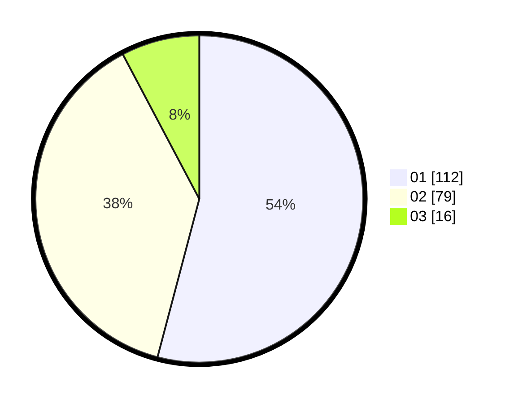

# Hasil

Hasil perolehan suara paslon dapat dilihat pada file paslon-01.txt, paslon-02.txt, dan paslon-03.txt.

Jika tidak ada, artinya data tersebut belum ada pada SIREKAP.

## Perolehan Suara

 * Paslon 01: **112**.
 * Paslon 02: **79**.
 * Paslon 03: **16**.

## Foto C Plano

https://sirekap-obj-formc.kpu.go.id/428d/pemilu/ppwp/31/73/05/10/03/3173051003038-20240215-235354--5d9c3587-74c7-4f3c-9ece-f21e8b0ffc2e.jpg

https://sirekap-obj-formc.kpu.go.id/428d/pemilu/ppwp/31/73/05/10/03/3173051003038-20240215-235356--957c70e0-ce7b-4872-9f85-2133685ed931.jpg

https://sirekap-obj-formc.kpu.go.id/428d/pemilu/ppwp/31/73/05/10/03/3173051003038-20240215-235355--ab71b959-95a7-4808-8a8d-61fcadddd867.jpg

## DATA PEMILIH TETAP

Jumlah pemilih dalam DPT: **254**.
 * L: **121**.
 * P: **133**.

## DATA PENGGUNA HAK PILIH

Jumlah pengguna hak pilih dalam DPT: **202**.
 * L: **90**.
 * P: **112**.

Jumlah pengguna hak pilih dalam DPTb: **5**.
 * L: **2**.
 * P: **3**.

Jumlah pengguna hak pilih dalam DPK: **1**.
 * L: **0**.
 * P: **1**.

Jumlah pengguna hak pilih: **208**.
 * L: **92**.
 * P: **116**.

## JUMLAH SUARA SAH DAN TIDAK SAH

JUMLAH SELURUH SUARA SAH: **207**.

JUMLAH SUARA TIDAK SAH: **1**.

JUMLAH SELURUH SUARA SAH DAN SUARA TIDAK SAH: **208**.
