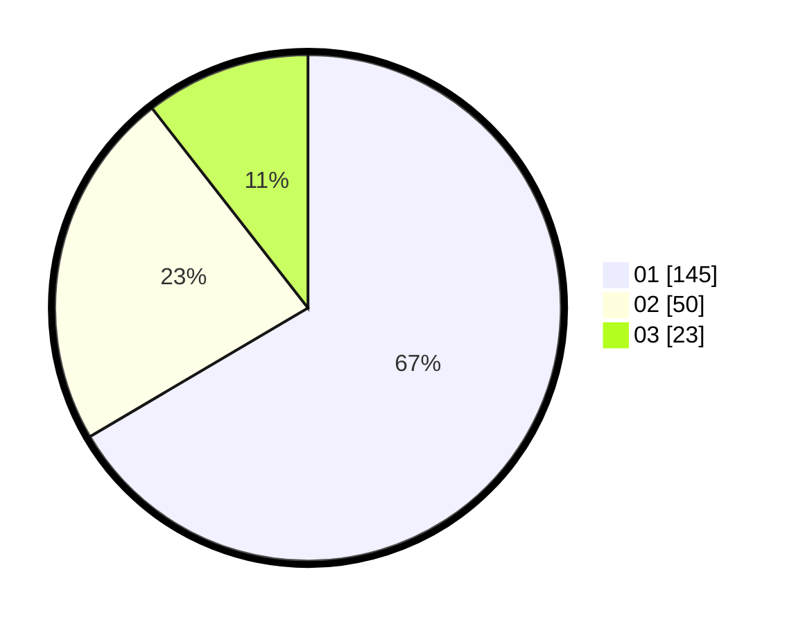

# Hasil

Hasil perolehan suara paslon dapat dilihat pada file paslon-01.txt, paslon-02.txt, dan paslon-03.txt.

Jika tidak ada, artinya data tersebut belum ada pada SIREKAP.

## Perolehan Suara

 * Paslon 01: **145**.
 * Paslon 02: **50**.
 * Paslon 03: **23**.

## Foto C Plano

https://sirekap-obj-formc.kpu.go.id/35c2/pemilu/ppwp/31/73/05/10/03/3173051003039-20240216-180042--6717ef66-ef3a-4f88-90a5-206ea95be726.jpg

https://sirekap-obj-formc.kpu.go.id/35c2/pemilu/ppwp/31/73/05/10/03/3173051003039-20240216-180044--1311ccf3-6ac3-4703-823c-4297fc5caef0.jpg

https://sirekap-obj-formc.kpu.go.id/35c2/pemilu/ppwp/31/73/05/10/03/3173051003039-20240216-180043--1ec7d571-09e3-4a17-9c03-2a0efc88a7ea.jpg

## DATA PEMILIH TETAP

Jumlah pemilih dalam DPT: **0**.
 * L: **0**.
 * P: **0**.

## DATA PENGGUNA HAK PILIH

Jumlah pengguna hak pilih dalam DPT: **0**.
 * L: **0**.
 * P: **0**.

Jumlah pengguna hak pilih dalam DPTb: **0**.
 * L: **0**.
 * P: **0**.

Jumlah pengguna hak pilih dalam DPK: **0**.
 * L: **0**.
 * P: **0**.

Jumlah pengguna hak pilih: **0**.
 * L: **0**.
 * P: **0**.

## JUMLAH SUARA SAH DAN TIDAK SAH

JUMLAH SELURUH SUARA SAH: **218**.

JUMLAH SUARA TIDAK SAH: **2**.

JUMLAH SELURUH SUARA SAH DAN SUARA TIDAK SAH: **220**.
