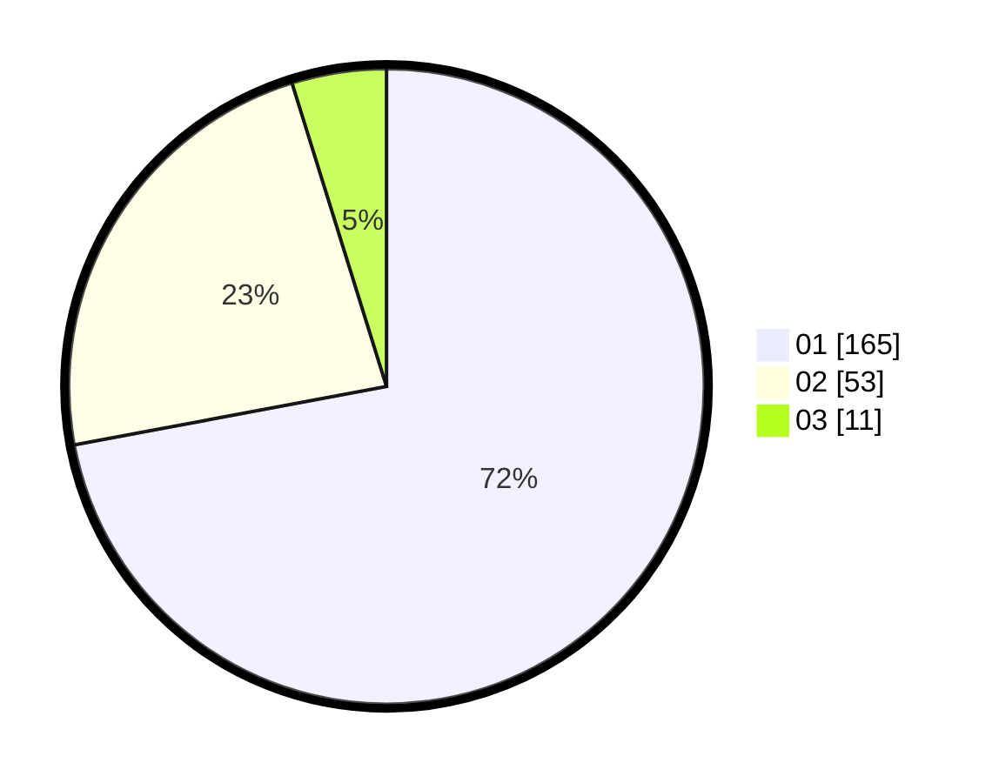

# Hasil

Hasil perolehan suara paslon dapat dilihat pada file paslon-01.txt, paslon-02.txt, dan paslon-03.txt.

Jika tidak ada, artinya data tersebut belum ada pada SIREKAP.

## Perolehan Suara

 * Paslon 01: **165**.
 * Paslon 02: **53**.
 * Paslon 03: **11**.

## Foto C Plano

https://sirekap-obj-formc.kpu.go.id/ce70/pemilu/ppwp/31/73/05/10/03/3173051003040-20240215-025635--e61b9d36-14b6-4a3a-8a1b-86f72d7b7c42.jpg

https://sirekap-obj-formc.kpu.go.id/ce70/pemilu/ppwp/31/73/05/10/03/3173051003040-20240215-011108--c8c6ad87-f637-400b-a40f-480317fbd8a4.jpg

https://sirekap-obj-formc.kpu.go.id/ce70/pemilu/ppwp/31/73/05/10/03/3173051003040-20240215-021458--cdfe1c62-5288-4d8b-9bf0-2b670ec62ebc.jpg
