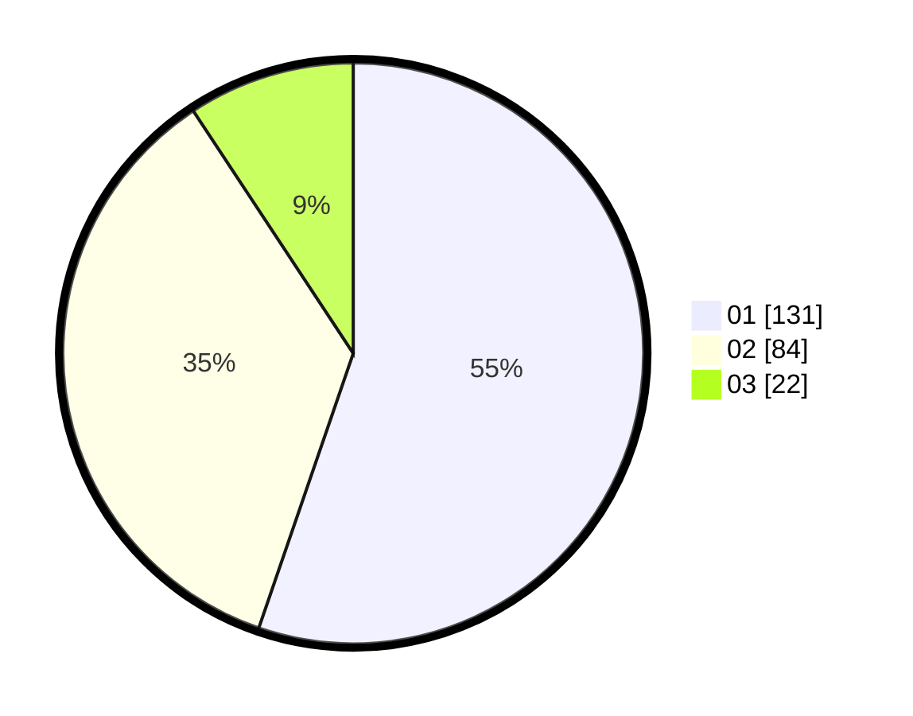

# Hasil

Hasil perolehan suara paslon dapat dilihat pada file paslon-01.txt, paslon-02.txt, dan paslon-03.txt.

Jika tidak ada, artinya data tersebut belum ada pada SIREKAP.

## Perolehan Suara

 * Paslon 01: **131**.
 * Paslon 02: **84**.
 * Paslon 03: **22**.

## Foto C Plano

https://sirekap-obj-formc.kpu.go.id/8ebb/pemilu/ppwp/31/73/05/10/03/3173051003041-20240215-000721--774f42f6-f5f7-40e3-a4f2-690762ad1ede.jpg

https://sirekap-obj-formc.kpu.go.id/8ebb/pemilu/ppwp/31/73/05/10/03/3173051003041-20240214-202713--cdc03b95-d7ed-408b-b4a3-834eb4b16351.jpg

https://sirekap-obj-formc.kpu.go.id/8ebb/pemilu/ppwp/31/73/05/10/03/3173051003041-20240215-001135--d4409751-1e9c-416e-994e-c383ffdf9dea.jpg

## DATA PEMILIH TETAP

Jumlah pemilih dalam DPT: **279**.
 * L: **137**.
 * P: **142**.

## DATA PENGGUNA HAK PILIH

Jumlah pengguna hak pilih dalam DPT: **234**.
 * L: **118**.
 * P: **116**.

Jumlah pengguna hak pilih dalam DPTb: **1**.
 * L: **0**.
 * P: **1**.

Jumlah pengguna hak pilih dalam DPK: **4**.
 * L: **0**.
 * P: **4**.

Jumlah pengguna hak pilih: **239**.
 * L: **118**.
 * P: **121**.

## JUMLAH SUARA SAH DAN TIDAK SAH

JUMLAH SELURUH SUARA SAH: **237**.

JUMLAH SUARA TIDAK SAH: **2**.

JUMLAH SELURUH SUARA SAH DAN SUARA TIDAK SAH: **239**.
