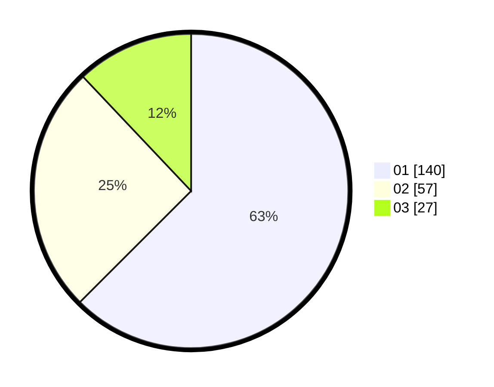

# Hasil

Hasil perolehan suara paslon dapat dilihat pada file paslon-01.txt, paslon-02.txt, dan paslon-03.txt.

Jika tidak ada, artinya data tersebut belum ada pada SIREKAP.

## Perolehan Suara

 * Paslon 01: **140**.
 * Paslon 02: **57**.
 * Paslon 03: **27**.

## Foto C Plano

https://sirekap-obj-formc.kpu.go.id/6962/pemilu/ppwp/31/73/05/10/03/3173051003042-20240216-183136--3f17e435-51e0-43cb-a6af-33b0f59b9a4f.jpg

https://sirekap-obj-formc.kpu.go.id/6962/pemilu/ppwp/31/73/05/10/03/3173051003042-20240215-014343--2f753382-84f0-4846-9745-624cedcb0651.jpg

https://sirekap-obj-formc.kpu.go.id/6962/pemilu/ppwp/31/73/05/10/03/3173051003042-20240215-014640--031eee4b-8be6-440b-bd2d-cd09e6e281f4.jpg

## DATA PEMILIH TETAP

Jumlah pemilih dalam DPT: **276**.
 * L: **139**.
 * P: **137**.

## DATA PENGGUNA HAK PILIH

Jumlah pengguna hak pilih dalam DPT: **224**.
 * L: **110**.
 * P: **114**.

Jumlah pengguna hak pilih dalam DPTb: **0**.
 * L: **0**.
 * P: **0**.

Jumlah pengguna hak pilih dalam DPK: **3**.
 * L: **2**.
 * P: **1**.

Jumlah pengguna hak pilih: **227**.
 * L: **112**.
 * P: **115**.

## JUMLAH SUARA SAH DAN TIDAK SAH

JUMLAH SELURUH SUARA SAH: **224**.

JUMLAH SUARA TIDAK SAH: **3**.

JUMLAH SELURUH SUARA SAH DAN SUARA TIDAK SAH: **227**.
