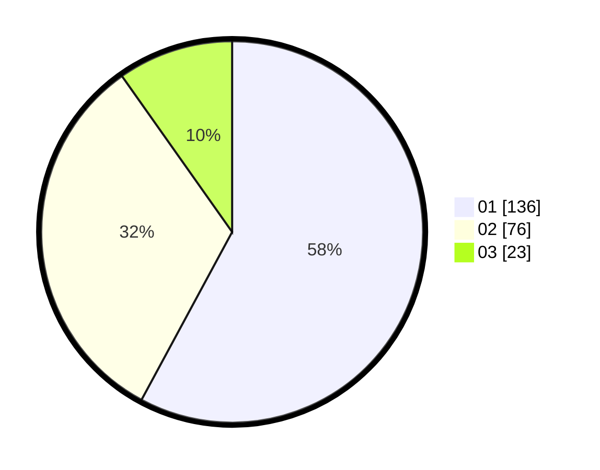

# Hasil

Hasil perolehan suara paslon dapat dilihat pada file paslon-01.txt, paslon-02.txt, dan paslon-03.txt.

Jika tidak ada, artinya data tersebut belum ada pada SIREKAP.

## Perolehan Suara

 * Paslon 01: **136**.
 * Paslon 02: **76**.
 * Paslon 03: **23**.

## Foto C Plano

https://sirekap-obj-formc.kpu.go.id/20b7/pemilu/ppwp/31/73/05/10/03/3173051003047-20240214-213149--8207ef19-6424-4214-bb48-835ecb36f091.jpg

https://sirekap-obj-formc.kpu.go.id/20b7/pemilu/ppwp/31/73/05/10/03/3173051003047-20240214-213257--d3cf9336-df55-4d5b-a4dc-99a52c0ca1fc.jpg

https://sirekap-obj-formc.kpu.go.id/20b7/pemilu/ppwp/31/73/05/10/03/3173051003047-20240214-213404--8b9b34b3-cd7b-4772-8d50-6a9ee5717078.jpg

## DATA PEMILIH TETAP

Jumlah pemilih dalam DPT: **285**.
 * L: **138**.
 * P: **147**.

## DATA PENGGUNA HAK PILIH

Jumlah pengguna hak pilih dalam DPT: **236**.
 * L: **112**.
 * P: **124**.

Jumlah pengguna hak pilih dalam DPTb: **1**.
 * L: **1**.
 * P: **0**.

Jumlah pengguna hak pilih dalam DPK: **0**.
 * L: **0**.
 * P: **0**.

Jumlah pengguna hak pilih: **237**.
 * L: **113**.
 * P: **124**.

## JUMLAH SUARA SAH DAN TIDAK SAH

JUMLAH SELURUH SUARA SAH: **235**.

JUMLAH SUARA TIDAK SAH: **2**.

JUMLAH SELURUH SUARA SAH DAN SUARA TIDAK SAH: **237**.
