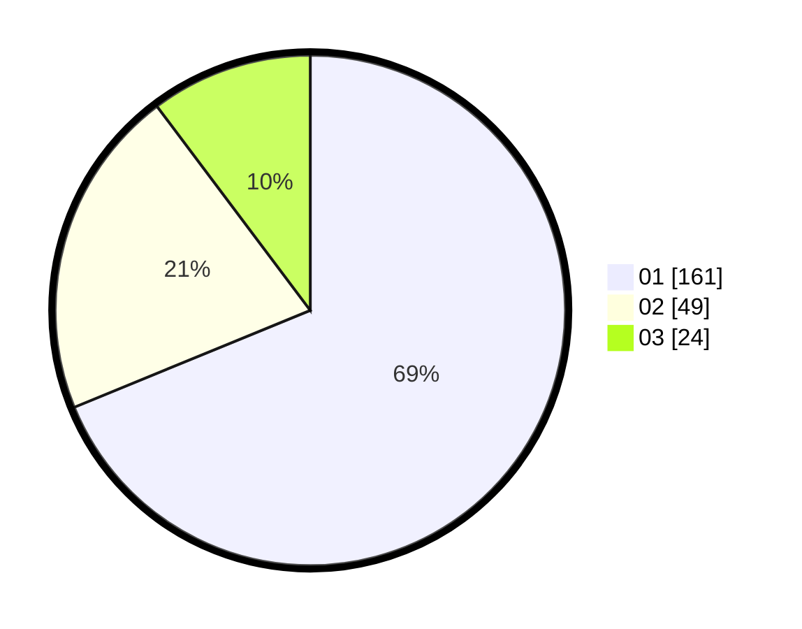

# Hasil

Hasil perolehan suara paslon dapat dilihat pada file paslon-01.txt, paslon-02.txt, dan paslon-03.txt.

Jika tidak ada, artinya data tersebut belum ada pada SIREKAP.

## Perolehan Suara

 * Paslon 01: **161**.
 * Paslon 02: **49**.
 * Paslon 03: **24**.

## Foto C Plano

https://sirekap-obj-formc.kpu.go.id/3ddc/pemilu/ppwp/31/73/05/10/03/3173051003048-20240214-212126--a3adabf9-9714-40b5-a7d4-443669b68526.jpg

https://sirekap-obj-formc.kpu.go.id/3ddc/pemilu/ppwp/31/73/05/10/03/3173051003048-20240214-201353--b0e27e12-8619-4ae3-b0c0-72916b5c9c87.jpg

https://sirekap-obj-formc.kpu.go.id/3ddc/pemilu/ppwp/31/73/05/10/03/3173051003048-20240214-212259--59dd45ea-bfda-4b33-8083-7343e8dcfe71.jpg

## DATA PEMILIH TETAP

Jumlah pemilih dalam DPT: **287**.
 * L: **147**.
 * P: **140**.

## DATA PENGGUNA HAK PILIH

Jumlah pengguna hak pilih dalam DPT: **231**.
 * L: **111**.
 * P: **120**.

Jumlah pengguna hak pilih dalam DPTb: **4**.
 * L: **1**.
 * P: **3**.

Jumlah pengguna hak pilih dalam DPK: **2**.
 * L: **0**.
 * P: **2**.

Jumlah pengguna hak pilih: **237**.
 * L: **112**.
 * P: **125**.

## JUMLAH SUARA SAH DAN TIDAK SAH

JUMLAH SELURUH SUARA SAH: **234**.

JUMLAH SUARA TIDAK SAH: **3**.

JUMLAH SELURUH SUARA SAH DAN SUARA TIDAK SAH: **237**.
