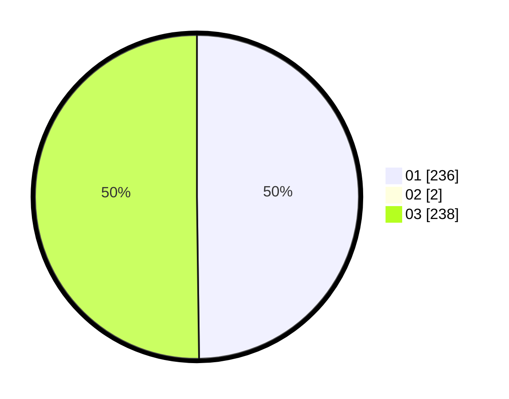

# Hasil

Hasil perolehan suara paslon dapat dilihat pada file paslon-01.txt, paslon-02.txt, dan paslon-03.txt.

Jika tidak ada, artinya data tersebut belum ada pada SIREKAP.

## Perolehan Suara

 * Paslon 01: **236**.
 * Paslon 02: **2**.
 * Paslon 03: **238**.

## Foto C Plano

https://sirekap-obj-formc.kpu.go.id/4661/pemilu/ppwp/31/73/05/10/03/3173051003052-20240215-023052--d7b06209-3cf1-48d8-8b84-bf1be2c148cd.jpg

https://sirekap-obj-formc.kpu.go.id/4661/pemilu/ppwp/31/73/05/10/03/3173051003052-20240215-023105--56bc2da2-a51b-499e-9e8d-0239ff5dabf4.jpg

https://sirekap-obj-formc.kpu.go.id/4661/pemilu/ppwp/31/73/05/10/03/3173051003052-20240215-023421--6c219000-56de-498c-bd06-5ec521edef23.jpg
