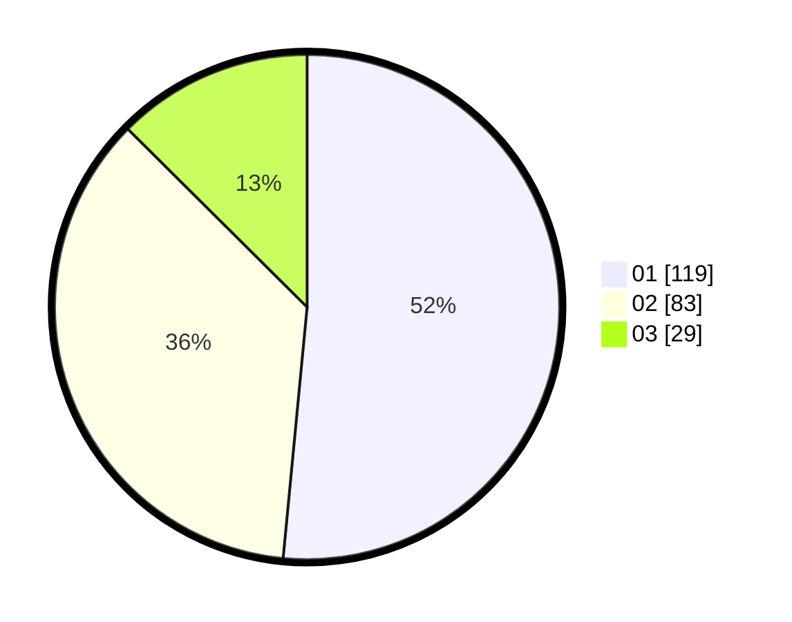

# Hasil

Hasil perolehan suara paslon dapat dilihat pada file paslon-01.txt, paslon-02.txt, dan paslon-03.txt.

Jika tidak ada, artinya data tersebut belum ada pada SIREKAP.

## Perolehan Suara

 * Paslon 01: **119**.
 * Paslon 02: **83**.
 * Paslon 03: **29**.

## Foto C Plano

https://sirekap-obj-formc.kpu.go.id/efc2/pemilu/ppwp/31/73/05/10/03/3173051003053-20240215-012946--efaf59e5-482b-4bc4-8824-acfcbfa43671.jpg

https://sirekap-obj-formc.kpu.go.id/efc2/pemilu/ppwp/31/73/05/10/03/3173051003053-20240215-013153--cbb95409-ceef-453e-bd92-fd95d2221298.jpg

https://sirekap-obj-formc.kpu.go.id/efc2/pemilu/ppwp/31/73/05/10/03/3173051003053-20240215-013547--dffd7ef1-c6cb-45f8-a292-c1495a317128.jpg
