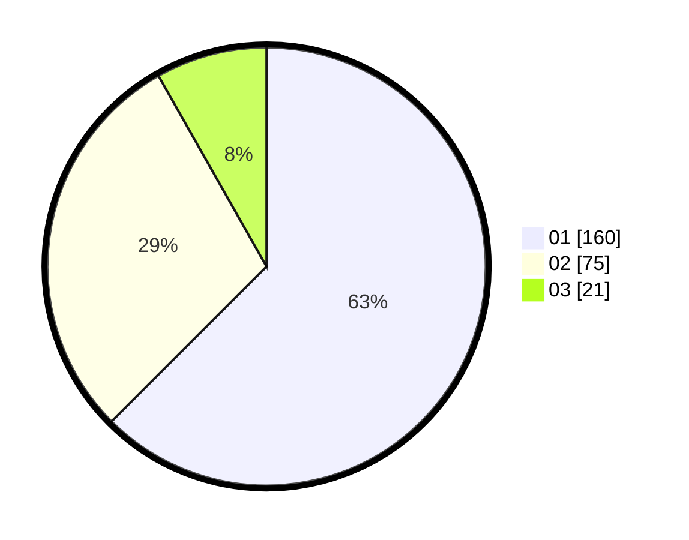

# Hasil

Hasil perolehan suara paslon dapat dilihat pada file paslon-01.txt, paslon-02.txt, dan paslon-03.txt.

Jika tidak ada, artinya data tersebut belum ada pada SIREKAP.

## Perolehan Suara

 * Paslon 01: **160**.
 * Paslon 02: **75**.
 * Paslon 03: **21**.

## Foto C Plano

https://sirekap-obj-formc.kpu.go.id/2d37/pemilu/ppwp/31/73/05/10/03/3173051003054-20240215-005209--8dee543d-1db2-43c5-b015-067d68c79420.jpg

https://sirekap-obj-formc.kpu.go.id/2d37/pemilu/ppwp/31/73/05/10/03/3173051003054-20240215-005541--a6485ea7-974d-44f2-8fd2-faace267047b.jpg

https://sirekap-obj-formc.kpu.go.id/2d37/pemilu/ppwp/31/73/05/10/03/3173051003054-20240215-005711--d07f0c72-11da-4c27-86a8-29cdddec9dd7.jpg
