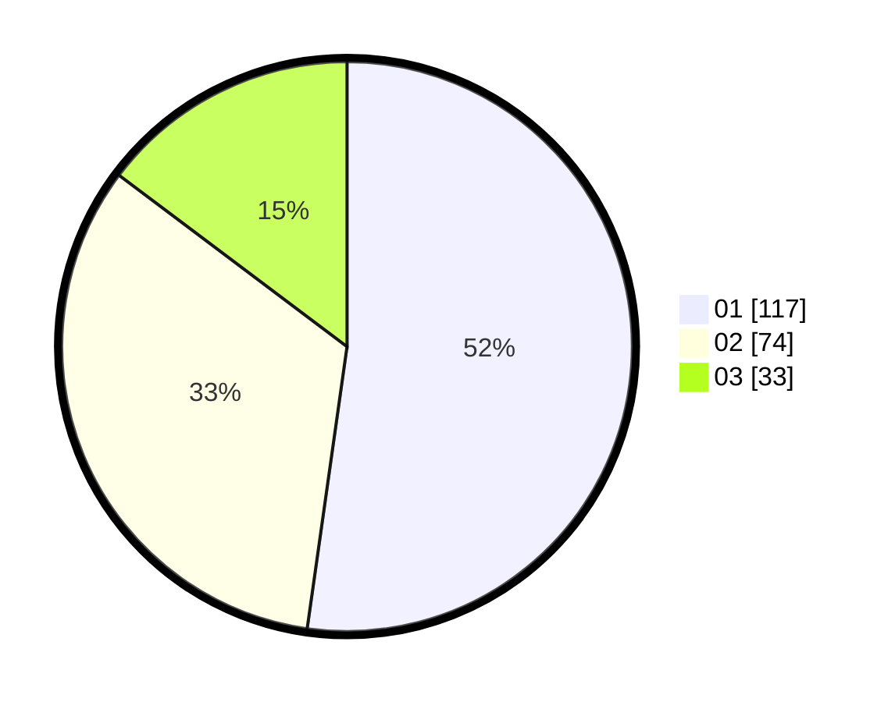

# Hasil

Hasil perolehan suara paslon dapat dilihat pada file paslon-01.txt, paslon-02.txt, dan paslon-03.txt.

Jika tidak ada, artinya data tersebut belum ada pada SIREKAP.

## Perolehan Suara

 * Paslon 01: **117**.
 * Paslon 02: **74**.
 * Paslon 03: **33**.

## Foto C Plano

https://sirekap-obj-formc.kpu.go.id/e6e8/pemilu/ppwp/31/73/05/10/03/3173051003055-20240215-221203--ca12a45c-3ecd-4ef8-96af-361be2907a86.jpg

https://sirekap-obj-formc.kpu.go.id/e6e8/pemilu/ppwp/31/73/05/10/03/3173051003055-20240214-201631--02059402-74c7-4ce0-a9e0-79ef4c89da24.jpg

https://sirekap-obj-formc.kpu.go.id/e6e8/pemilu/ppwp/31/73/05/10/03/3173051003055-20240214-201715--875f1d01-1145-4aed-8207-740edaf9ee5c.jpg

## DATA PEMILIH TETAP

Jumlah pemilih dalam DPT: **277**.
 * L: **141**.
 * P: **136**.

## DATA PENGGUNA HAK PILIH

Jumlah pengguna hak pilih dalam DPT: **207**.
 * L: **99**.
 * P: **108**.

Jumlah pengguna hak pilih dalam DPTb: **18**.
 * L: **8**.
 * P: **10**.

Jumlah pengguna hak pilih dalam DPK: **1**.
 * L: **1**.
 * P: **0**.

Jumlah pengguna hak pilih: **226**.
 * L: **108**.
 * P: **118**.

## JUMLAH SUARA SAH DAN TIDAK SAH

JUMLAH SELURUH SUARA SAH: **224**.

JUMLAH SUARA TIDAK SAH: **0**.

JUMLAH SELURUH SUARA SAH DAN SUARA TIDAK SAH: **275**.
