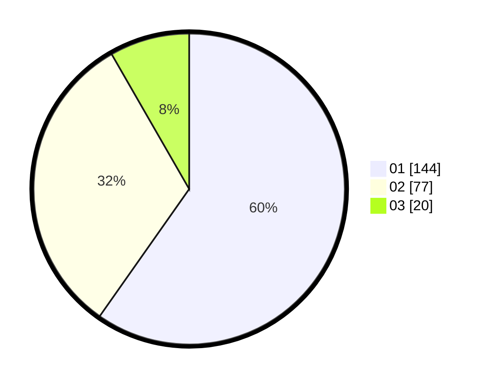

# Hasil

Hasil perolehan suara paslon dapat dilihat pada file paslon-01.txt, paslon-02.txt, dan paslon-03.txt.

Jika tidak ada, artinya data tersebut belum ada pada SIREKAP.

## Perolehan Suara

 * Paslon 01: **144**.
 * Paslon 02: **77**.
 * Paslon 03: **20**.

## Foto C Plano

https://sirekap-obj-formc.kpu.go.id/38b2/pemilu/ppwp/31/73/05/10/03/3173051003057-20240216-060237--fbf4789e-dca8-4334-b11d-cc771d20990c.jpg

https://sirekap-obj-formc.kpu.go.id/38b2/pemilu/ppwp/31/73/05/10/03/3173051003057-20240216-060240--e6e29b60-6c50-48b9-85c1-713a5c6ca072.jpg

https://sirekap-obj-formc.kpu.go.id/38b2/pemilu/ppwp/31/73/05/10/03/3173051003057-20240216-060238--a7f02955-fe75-485a-8022-eade7e35ca90.jpg

## DATA PEMILIH TETAP

Jumlah pemilih dalam DPT: **278**.
 * L: **144**.
 * P: **134**.

## DATA PENGGUNA HAK PILIH

Jumlah pengguna hak pilih dalam DPT: **238**.
 * L: **123**.
 * P: **115**.

Jumlah pengguna hak pilih dalam DPTb: **3**.
 * L: **3**.
 * P: **0**.

Jumlah pengguna hak pilih dalam DPK: **1**.
 * L: **1**.
 * P: **0**.

Jumlah pengguna hak pilih: **242**.
 * L: **127**.
 * P: **115**.

## JUMLAH SUARA SAH DAN TIDAK SAH

JUMLAH SELURUH SUARA SAH: **241**.

JUMLAH SUARA TIDAK SAH: **1**.

JUMLAH SELURUH SUARA SAH DAN SUARA TIDAK SAH: **242**.
