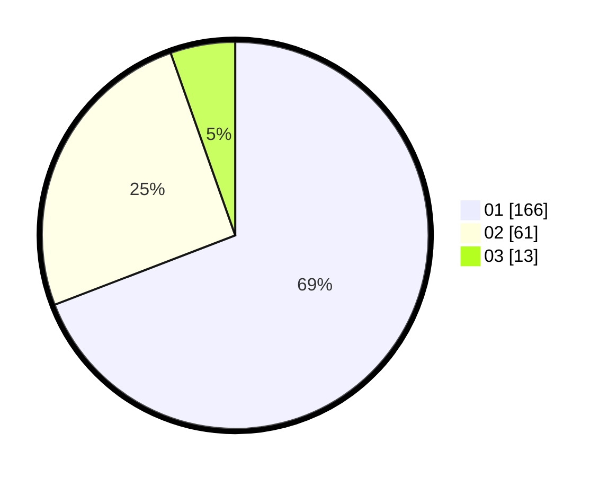

# Hasil

Hasil perolehan suara paslon dapat dilihat pada file paslon-01.txt, paslon-02.txt, dan paslon-03.txt.

Jika tidak ada, artinya data tersebut belum ada pada SIREKAP.

## Perolehan Suara

 * Paslon 01: **166**.
 * Paslon 02: **61**.
 * Paslon 03: **13**.

## Foto C Plano

https://sirekap-obj-formc.kpu.go.id/e016/pemilu/ppwp/31/73/05/10/03/3173051003058-20240214-214105--f5db021a-2202-4167-abf1-6cb956d76767.jpg

https://sirekap-obj-formc.kpu.go.id/e016/pemilu/ppwp/31/73/05/10/03/3173051003058-20240214-214151--2856de7b-1622-43e2-a313-1b070c69911a.jpg

https://sirekap-obj-formc.kpu.go.id/e016/pemilu/ppwp/31/73/05/10/03/3173051003058-20240214-214216--c1ec2af5-6770-4cb8-bb3f-9a5051339326.jpg
