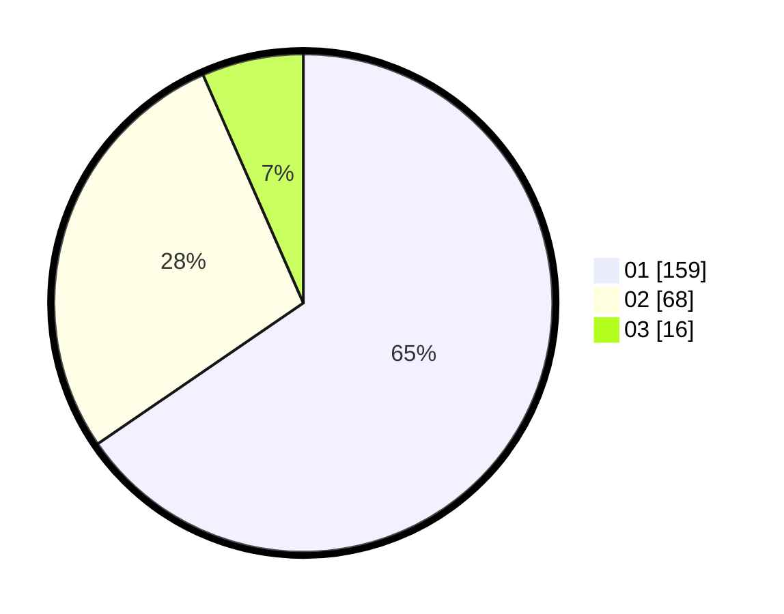

# Hasil

Hasil perolehan suara paslon dapat dilihat pada file paslon-01.txt, paslon-02.txt, dan paslon-03.txt.

Jika tidak ada, artinya data tersebut belum ada pada SIREKAP.

## Perolehan Suara

 * Paslon 01: **159**.
 * Paslon 02: **68**.
 * Paslon 03: **16**.

## Foto C Plano

https://sirekap-obj-formc.kpu.go.id/8e44/pemilu/ppwp/31/73/05/10/03/3173051003060-20240214-230141--5ecf9445-f020-4ac8-8fae-de29b04c50b9.jpg

https://sirekap-obj-formc.kpu.go.id/8e44/pemilu/ppwp/31/73/05/10/03/3173051003060-20240214-230301--e14625a5-1d67-4c79-b407-ad2ab558f0d9.jpg

https://sirekap-obj-formc.kpu.go.id/8e44/pemilu/ppwp/31/73/05/10/03/3173051003060-20240214-230415--2c6aeda1-7425-4547-ac89-eab94e4d2bb1.jpg
