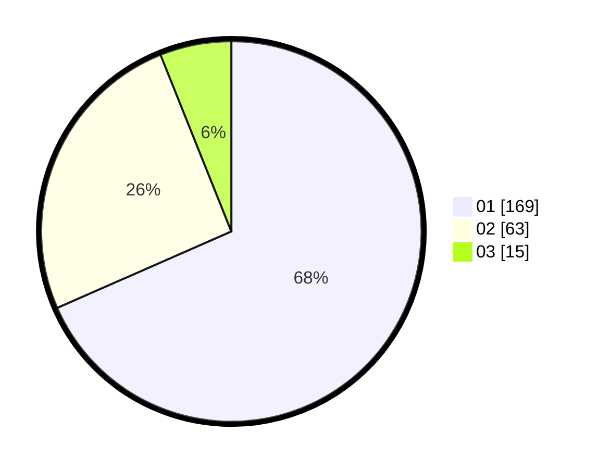

# Hasil

Hasil perolehan suara paslon dapat dilihat pada file paslon-01.txt, paslon-02.txt, dan paslon-03.txt.

Jika tidak ada, artinya data tersebut belum ada pada SIREKAP.

## Perolehan Suara

 * Paslon 01: **169**.
 * Paslon 02: **63**.
 * Paslon 03: **15**.

## Foto C Plano

https://sirekap-obj-formc.kpu.go.id/4696/pemilu/ppwp/31/73/05/10/03/3173051003061-20240214-235807--dfb0f707-f1ac-4e05-8ada-66c42809d6fc.jpg

https://sirekap-obj-formc.kpu.go.id/4696/pemilu/ppwp/31/73/05/10/03/3173051003061-20240214-232642--6290b330-bf5f-49a5-9618-224be0fa35d1.jpg

https://sirekap-obj-formc.kpu.go.id/4696/pemilu/ppwp/31/73/05/10/03/3173051003061-20240214-233001--5c237012-14d2-4f91-aa53-4c35a2cd784c.jpg
