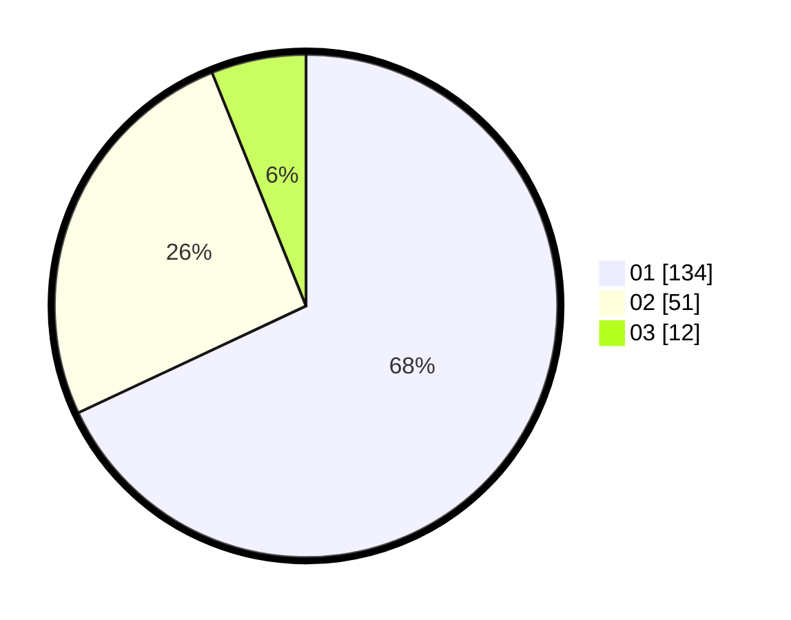

# Hasil

Hasil perolehan suara paslon dapat dilihat pada file paslon-01.txt, paslon-02.txt, dan paslon-03.txt.

Jika tidak ada, artinya data tersebut belum ada pada SIREKAP.

## Perolehan Suara

 * Paslon 01: **134**.
 * Paslon 02: **51**.
 * Paslon 03: **12**.

## Foto C Plano

https://sirekap-obj-formc.kpu.go.id/565f/pemilu/ppwp/31/73/05/10/03/3173051003064-20240214-232719--9868466a-874c-4141-9ea7-729cd39c2a12.jpg

https://sirekap-obj-formc.kpu.go.id/565f/pemilu/ppwp/31/73/05/10/03/3173051003064-20240214-232812--5db94d37-ba48-47e6-b200-6dbde8d748b5.jpg

https://sirekap-obj-formc.kpu.go.id/565f/pemilu/ppwp/31/73/05/10/03/3173051003064-20240214-232901--6d0bfdc2-22ae-4752-9021-a9e31436515c.jpg
