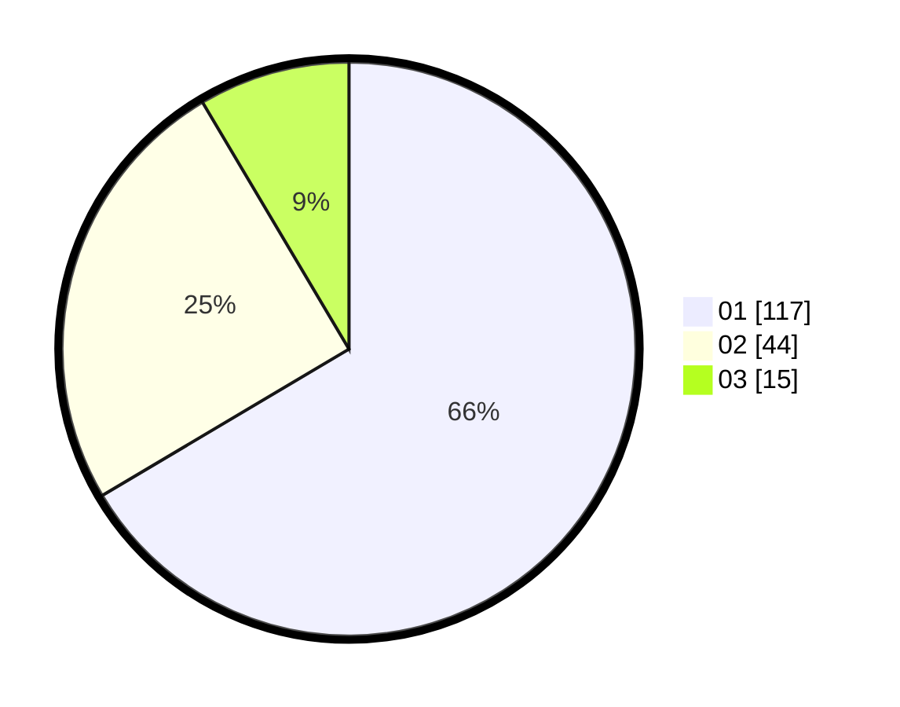

# Hasil

Hasil perolehan suara paslon dapat dilihat pada file paslon-01.txt, paslon-02.txt, dan paslon-03.txt.

Jika tidak ada, artinya data tersebut belum ada pada SIREKAP.

## Perolehan Suara

 * Paslon 01: **117**.
 * Paslon 02: **44**.
 * Paslon 03: **15**.

## Foto C Plano

https://sirekap-obj-formc.kpu.go.id/64b2/pemilu/ppwp/31/73/05/10/03/3173051003066-20240214-204456--210fac11-4215-4b32-a79e-fb057ee723c2.jpg

https://sirekap-obj-formc.kpu.go.id/64b2/pemilu/ppwp/31/73/05/10/03/3173051003066-20240214-204521--83533835-764c-490f-b2be-5997b0a12f39.jpg

https://sirekap-obj-formc.kpu.go.id/64b2/pemilu/ppwp/31/73/05/10/03/3173051003066-20240214-204530--e5537497-4b9c-4d3d-b01d-8d12ca5a930a.jpg

## DATA PEMILIH TETAP

Jumlah pemilih dalam DPT: **166**.
 * L: **79**.
 * P: **87**.

## DATA PENGGUNA HAK PILIH

Jumlah pengguna hak pilih dalam DPT: **166**.
 * L: **79**.
 * P: **87**.

Jumlah pengguna hak pilih dalam DPTb: **0**.
 * L: **0**.
 * P: **0**.

Jumlah pengguna hak pilih dalam DPK: **8**.
 * L: **4**.
 * P: **4**.

Jumlah pengguna hak pilih: **174**.
 * L: **83**.
 * P: **91**.

## JUMLAH SUARA SAH DAN TIDAK SAH

JUMLAH SELURUH SUARA SAH: **172**.

JUMLAH SUARA TIDAK SAH: **2**.

JUMLAH SELURUH SUARA SAH DAN SUARA TIDAK SAH: **174**.
