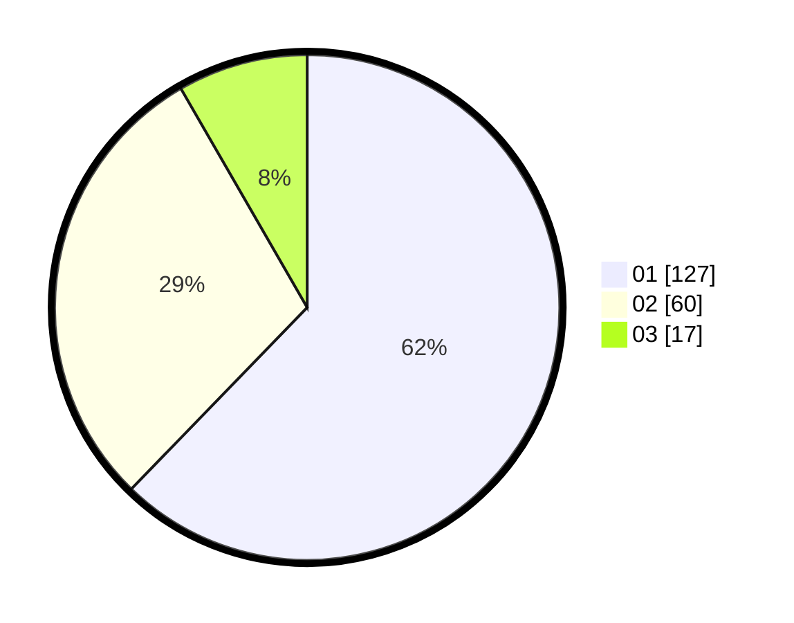

# Hasil

Hasil perolehan suara paslon dapat dilihat pada file paslon-01.txt, paslon-02.txt, dan paslon-03.txt.

Jika tidak ada, artinya data tersebut belum ada pada SIREKAP.

## Perolehan Suara

 * Paslon 01: **127**.
 * Paslon 02: **60**.
 * Paslon 03: **17**.

## Foto C Plano

https://sirekap-obj-formc.kpu.go.id/eb5e/pemilu/ppwp/31/73/05/10/03/3173051003067-20240216-024211--027e7db4-a9f0-4c6c-8145-02106bfd78d1.jpg

https://sirekap-obj-formc.kpu.go.id/eb5e/pemilu/ppwp/31/73/05/10/03/3173051003067-20240214-202953--80717b2d-e2b4-477e-bfec-e6599b3d4ca1.jpg

https://sirekap-obj-formc.kpu.go.id/eb5e/pemilu/ppwp/31/73/05/10/03/3173051003067-20240214-203006--5f6d1a0d-da1e-441a-87f1-9d7368e9f95d.jpg

## DATA PEMILIH TETAP

Jumlah pemilih dalam DPT: **247**.
 * L: **120**.
 * P: **127**.

## DATA PENGGUNA HAK PILIH

Jumlah pengguna hak pilih dalam DPT: **192**.
 * L: **89**.
 * P: **103**.

Jumlah pengguna hak pilih dalam DPTb: **3**.
 * L: **1**.
 * P: **2**.

Jumlah pengguna hak pilih dalam DPK: **9**.
 * L: **3**.
 * P: **6**.

Jumlah pengguna hak pilih: **204**.
 * L: **93**.
 * P: **111**.

## JUMLAH SUARA SAH DAN TIDAK SAH

JUMLAH SELURUH SUARA SAH: **204**.

JUMLAH SUARA TIDAK SAH: **0**.

JUMLAH SELURUH SUARA SAH DAN SUARA TIDAK SAH: **204**.
