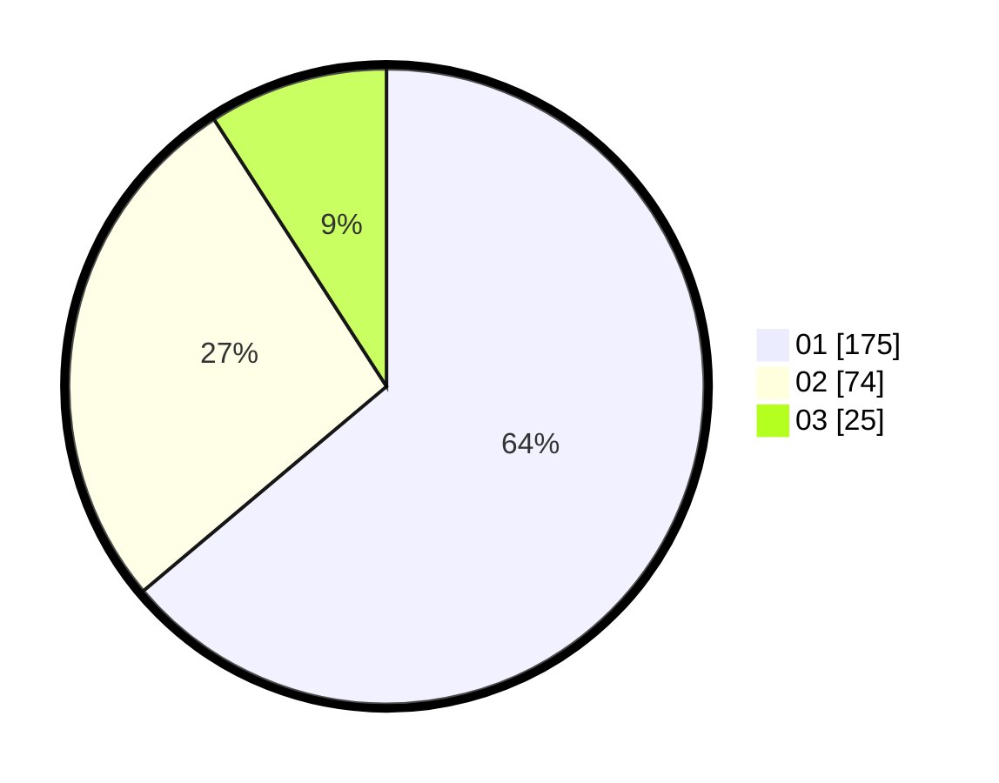

# Hasil

Hasil perolehan suara paslon dapat dilihat pada file paslon-01.txt, paslon-02.txt, dan paslon-03.txt.

Jika tidak ada, artinya data tersebut belum ada pada SIREKAP.

## Perolehan Suara

 * Paslon 01: **175**.
 * Paslon 02: **74**.
 * Paslon 03: **25**.

## Foto C Plano

https://sirekap-obj-formc.kpu.go.id/153c/pemilu/ppwp/31/73/05/10/03/3173051003069-20240214-193110--ef2705a1-7182-41c6-8b32-5815bbf16869.jpg

https://sirekap-obj-formc.kpu.go.id/153c/pemilu/ppwp/31/73/05/10/03/3173051003069-20240214-192357--268e8a19-223f-4cc9-8197-71a3458a00a9.jpg

https://sirekap-obj-formc.kpu.go.id/153c/pemilu/ppwp/31/73/05/10/03/3173051003069-20240214-192513--3f666769-f783-48e6-8394-05beaa64dc15.jpg

## DATA PEMILIH TETAP

Jumlah pemilih dalam DPT: **298**.
 * L: **141**.
 * P: **157**.

## DATA PENGGUNA HAK PILIH

Jumlah pengguna hak pilih dalam DPT: **267**.
 * L: **120**.
 * P: **147**.

Jumlah pengguna hak pilih dalam DPTb: **1**.
 * L: **1**.
 * P: **0**.

Jumlah pengguna hak pilih dalam DPK: **7**.
 * L: **2**.
 * P: **5**.

Jumlah pengguna hak pilih: **275**.
 * L: **123**.
 * P: **152**.

## JUMLAH SUARA SAH DAN TIDAK SAH

JUMLAH SELURUH SUARA SAH: **274**.

JUMLAH SUARA TIDAK SAH: **1**.

JUMLAH SELURUH SUARA SAH DAN SUARA TIDAK SAH: **275**.
