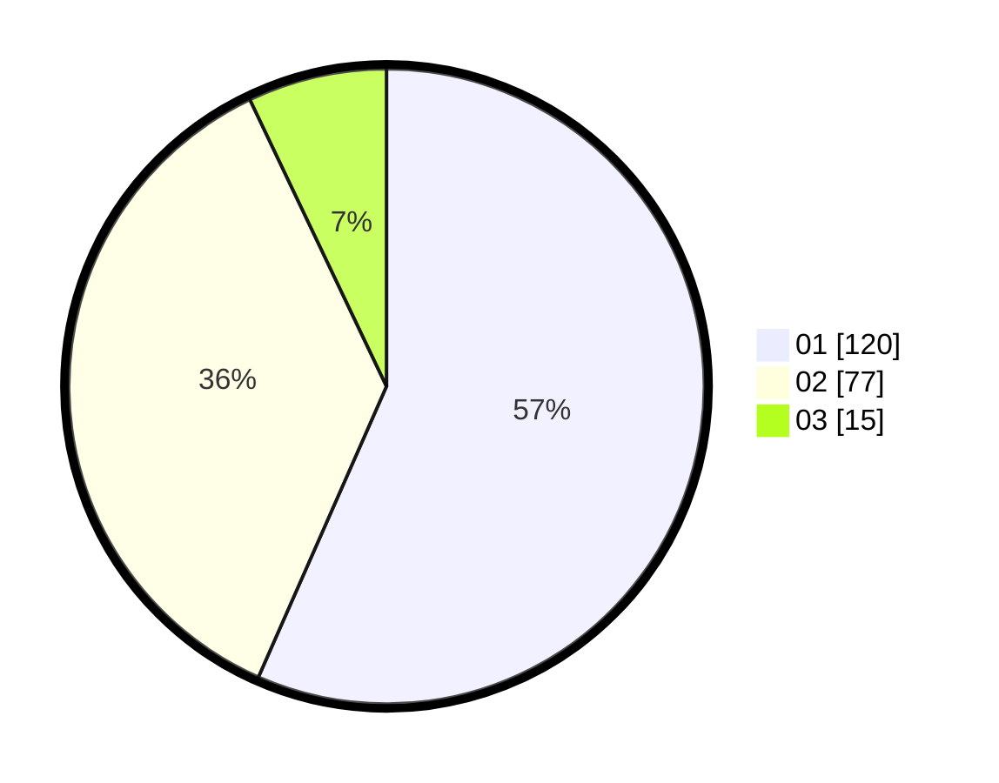

# Hasil

Hasil perolehan suara paslon dapat dilihat pada file paslon-01.txt, paslon-02.txt, dan paslon-03.txt.

Jika tidak ada, artinya data tersebut belum ada pada SIREKAP.

## Perolehan Suara

 * Paslon 01: **120**.
 * Paslon 02: **77**.
 * Paslon 03: **15**.

## Foto C Plano

https://sirekap-obj-formc.kpu.go.id/b02c/pemilu/ppwp/31/73/05/10/03/3173051003074-20240214-155141--69938c5d-24a8-444f-979d-37cefd1a4b32.jpg

https://sirekap-obj-formc.kpu.go.id/b02c/pemilu/ppwp/31/73/05/10/03/3173051003074-20240214-155342--0dfa1880-db64-444d-a93e-901c9a5526e2.jpg

https://sirekap-obj-formc.kpu.go.id/b02c/pemilu/ppwp/31/73/05/10/03/3173051003074-20240215-205308--159b67f3-efc3-4f48-b287-7a24e0bac3ad.jpg

## DATA PEMILIH TETAP

Jumlah pemilih dalam DPT: **268**.
 * L: **138**.
 * P: **130**.

## DATA PENGGUNA HAK PILIH

Jumlah pengguna hak pilih dalam DPT: **211**.
 * L: **107**.
 * P: **104**.

Jumlah pengguna hak pilih dalam DPTb: **1**.
 * L: **1**.
 * P: **0**.

Jumlah pengguna hak pilih dalam DPK: **2**.
 * L: **0**.
 * P: **2**.

Jumlah pengguna hak pilih: **214**.
 * L: **108**.
 * P: **106**.

## JUMLAH SUARA SAH DAN TIDAK SAH

JUMLAH SELURUH SUARA SAH: **212**.

JUMLAH SUARA TIDAK SAH: **2**.

JUMLAH SELURUH SUARA SAH DAN SUARA TIDAK SAH: **214**.
