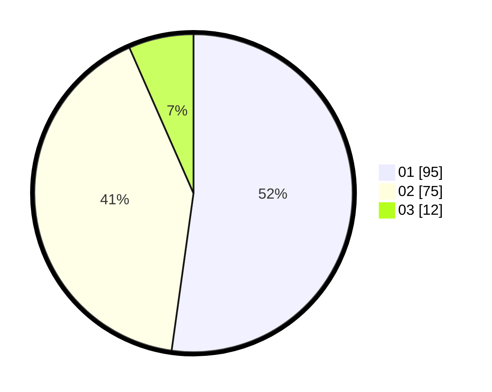

# Hasil

Hasil perolehan suara paslon dapat dilihat pada file paslon-01.txt, paslon-02.txt, dan paslon-03.txt.

Jika tidak ada, artinya data tersebut belum ada pada SIREKAP.

## Perolehan Suara

 * Paslon 01: **95**.
 * Paslon 02: **75**.
 * Paslon 03: **12**.

## Foto C Plano

https://sirekap-obj-formc.kpu.go.id/18af/pemilu/ppwp/31/73/05/10/03/3173051003076-20240215-002747--2f75f371-8142-49be-ab3e-b19328fb3d2c.jpg

https://sirekap-obj-formc.kpu.go.id/18af/pemilu/ppwp/31/73/05/10/03/3173051003076-20240215-001837--dc6bd706-b266-40ae-a863-b575fc8d1bd4.jpg

https://sirekap-obj-formc.kpu.go.id/18af/pemilu/ppwp/31/73/05/10/03/3173051003076-20240215-002034--954c2f7c-ebf8-43f4-a3f6-70b5ed910a9c.jpg
