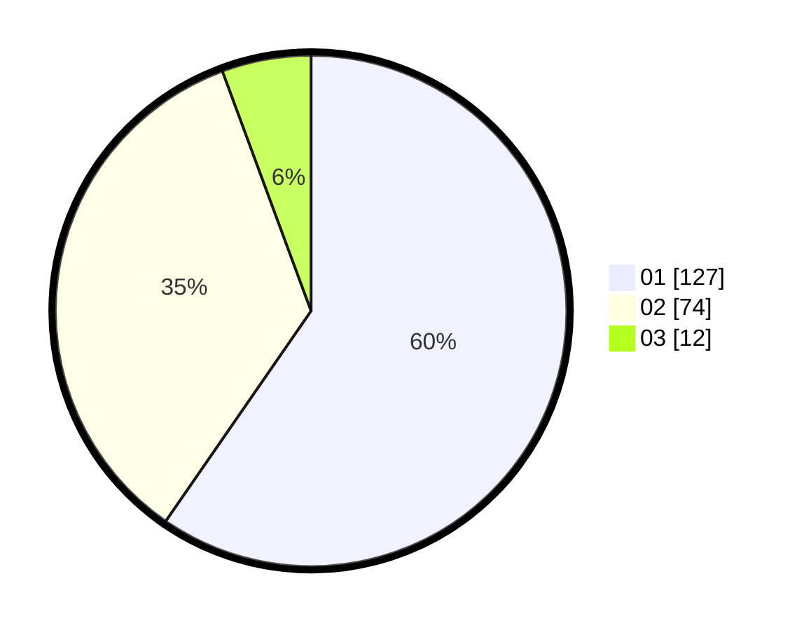

# Hasil

Hasil perolehan suara paslon dapat dilihat pada file paslon-01.txt, paslon-02.txt, dan paslon-03.txt.

Jika tidak ada, artinya data tersebut belum ada pada SIREKAP.

## Perolehan Suara

 * Paslon 01: **127**.
 * Paslon 02: **74**.
 * Paslon 03: **12**.

## Foto C Plano

https://sirekap-obj-formc.kpu.go.id/c4fa/pemilu/ppwp/31/73/05/10/03/3173051003079-20240214-155034--4b42b546-656c-45f3-a912-0bd89cf01b11.jpg

https://sirekap-obj-formc.kpu.go.id/c4fa/pemilu/ppwp/31/73/05/10/03/3173051003079-20240214-155704--96ce39ed-f524-4eb6-9ee1-aeaddc32ce4a.jpg

https://sirekap-obj-formc.kpu.go.id/c4fa/pemilu/ppwp/31/73/05/10/03/3173051003079-20240214-191427--ecfa4bcb-e300-41cf-babf-4ac25c8f9b78.jpg

## DATA PEMILIH TETAP

Jumlah pemilih dalam DPT: **272**.
 * L: **133**.
 * P: **139**.

## DATA PENGGUNA HAK PILIH

Jumlah pengguna hak pilih dalam DPT: **214**.
 * L: **100**.
 * P: **114**.

Jumlah pengguna hak pilih dalam DPTb: **0**.
 * L: **0**.
 * P: **0**.

Jumlah pengguna hak pilih dalam DPK: **0**.
 * L: **0**.
 * P: **0**.

Jumlah pengguna hak pilih: **214**.
 * L: **100**.
 * P: **114**.

## JUMLAH SUARA SAH DAN TIDAK SAH

JUMLAH SELURUH SUARA SAH: **213**.

JUMLAH SUARA TIDAK SAH: **1**.

JUMLAH SELURUH SUARA SAH DAN SUARA TIDAK SAH: **214**.
