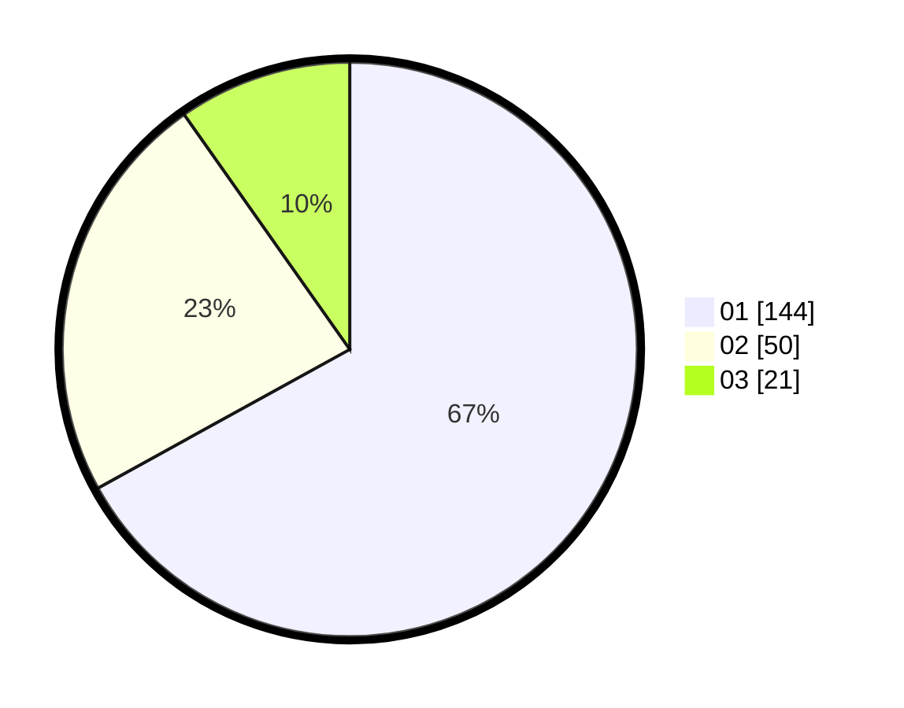

# Hasil

Hasil perolehan suara paslon dapat dilihat pada file paslon-01.txt, paslon-02.txt, dan paslon-03.txt.

Jika tidak ada, artinya data tersebut belum ada pada SIREKAP.

## Perolehan Suara

 * Paslon 01: **144**.
 * Paslon 02: **50**.
 * Paslon 03: **21**.

## Foto C Plano

https://sirekap-obj-formc.kpu.go.id/a4c7/pemilu/ppwp/31/73/05/10/03/3173051003080-20240215-020949--0c61445a-d5e9-4d7a-bbae-ce136aeac6cf.jpg

https://sirekap-obj-formc.kpu.go.id/a4c7/pemilu/ppwp/31/73/05/10/03/3173051003080-20240215-021208--66151193-12a1-4f29-9257-4963a89d5cbe.jpg

https://sirekap-obj-formc.kpu.go.id/a4c7/pemilu/ppwp/31/73/05/10/03/3173051003080-20240215-021348--4b140d0c-2f51-4bed-a455-8352500180d3.jpg
