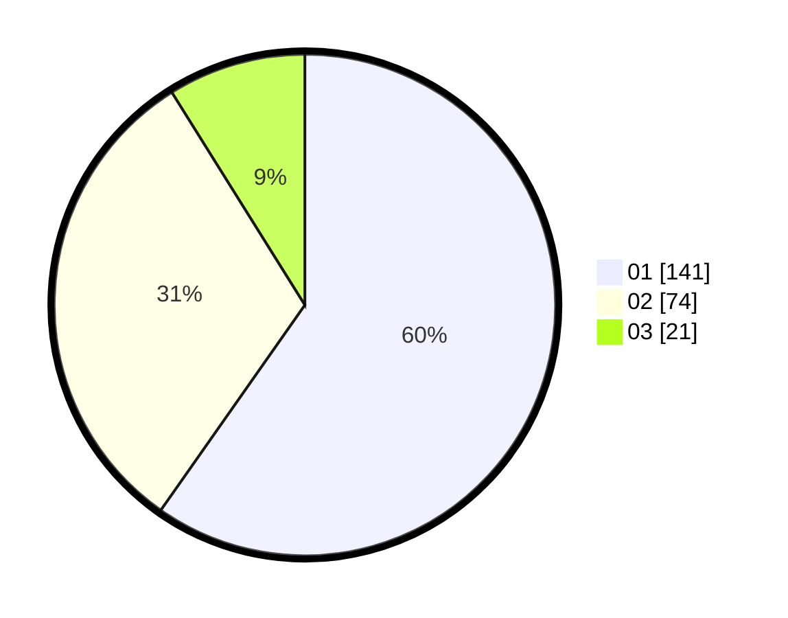

# Hasil

Hasil perolehan suara paslon dapat dilihat pada file paslon-01.txt, paslon-02.txt, dan paslon-03.txt.

Jika tidak ada, artinya data tersebut belum ada pada SIREKAP.

## Perolehan Suara

 * Paslon 01: **141**.
 * Paslon 02: **74**.
 * Paslon 03: **21**.

## Foto C Plano

https://sirekap-obj-formc.kpu.go.id/d807/pemilu/ppwp/31/73/05/10/03/3173051003082-20240214-225143--754fc818-d53c-45db-a9f7-077964ade59f.jpg

https://sirekap-obj-formc.kpu.go.id/d807/pemilu/ppwp/31/73/05/10/03/3173051003082-20240214-230100--54bce6bb-419d-47b7-9cc8-e7bcdd3ae156.jpg

https://sirekap-obj-formc.kpu.go.id/d807/pemilu/ppwp/31/73/05/10/03/3173051003082-20240214-230306--bb673b69-7615-40ec-a420-1dde9776da95.jpg
