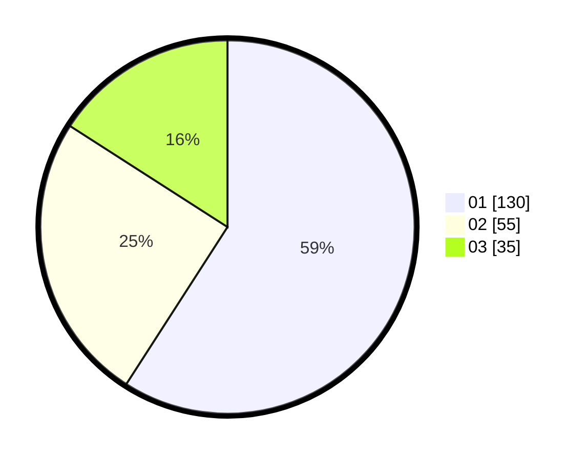

# Hasil

Hasil perolehan suara paslon dapat dilihat pada file paslon-01.txt, paslon-02.txt, dan paslon-03.txt.

Jika tidak ada, artinya data tersebut belum ada pada SIREKAP.

## Perolehan Suara

 * Paslon 01: **130**.
 * Paslon 02: **55**.
 * Paslon 03: **35**.

## Foto C Plano

https://sirekap-obj-formc.kpu.go.id/8eb2/pemilu/ppwp/31/73/05/10/03/3173051003084-20240215-030636--f6c216a5-eb3a-42e7-81ba-b014311b1c93.jpg

https://sirekap-obj-formc.kpu.go.id/8eb2/pemilu/ppwp/31/73/05/10/03/3173051003084-20240215-030818--d360af3c-b812-4a03-a4fd-db2080dd0ce1.jpg

https://sirekap-obj-formc.kpu.go.id/8eb2/pemilu/ppwp/31/73/05/10/03/3173051003084-20240214-234147--4ae8f15a-a30c-47e1-a7a7-6cdff5878bb9.jpg
